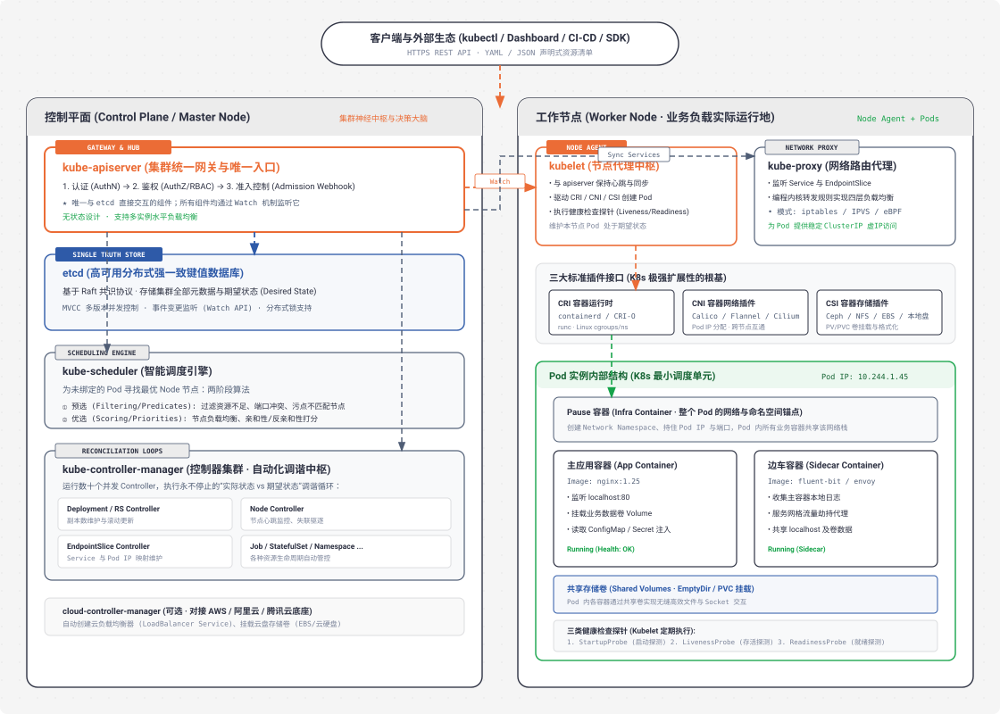

# Kubernetes (K8s) 全架构与核心模块深度解析

> **核心哲学**：*“声明式 API + 状态持续调谐 (Reconciliation Loop)”* —— 你只定义“期望状态 (Desired State)”，K8s 全自动帮你拉齐“实际状态 (Actual State)”。  
> **定位**：生产级容器编排与分布式操作系统内核。 

---

## 🌟 K8s 动态全景架构图 (Control Plane & Worker Node Topology)

<div align="center">
  
</div>

---

## 一、Kubernetes 的本质心智模型

如果你把整个数据中心（成百上千台物理服务器）看作一台**超级计算机**：
* **Linux 内核** 负责管理单机的 CPU、内存、磁盘和进程。
* **Kubernetes** 就是运行在数据中心里的**分布式操作系统内核**。
* **Pod** 就是这个操作系统里的“进程组”。
* **Container** 就是被 cgroups 和 namespaces 隔离的线程空间。

---

## 二、控制平面组件详解 (Control Plane / Master Node)

控制平面是集群的**大脑与指挥中枢**，负责接收指令、决策调度、维持状态和全局调度。

### 1. `kube-apiserver` (集群唯一网关与中枢神经)
* **核心职责**：
  1. **所有请求的唯一入口**：无论是 `kubectl` 命令行、Web Dashboard、CI/CD 流水线，还是集群内部的节点 Agent（`kubelet`），都必须且只能通过 HTTPS REST API 访问 APIServer。
  2. **请求处理三部曲**：
     * **认证 (Authentication - AuthN)**：确认“你是谁”（X.509 客户端证书、ServiceAccount Token、OIDC 身份凭据）。
     * **鉴权 (Authorization - AuthZ)**：确认“你能做什么”（RBAC 角色权限模型，如判断当前用户是否有权在 `prod` 命名空间创建 Pod）。
     * **准入控制 (Admission Control)**：在数据落盘前做最后修改或拦截（如自动注入 Sidecar 容器的 Mutating Webhook，或禁止使用 `latest` 镜像的 Validating Webhook）。
  3. **无状态设计 (Stateless)**：APIServer 自身不存储任何数据，天然支持水平扩展与多副本负载均衡。
  4. **唯一与 etcd 交互的组件**：控制平面的其他组件（Scheduler / Controller Manager）都不能直接查 etcd，必须通过 APIServer 的 `Watch` 机制订阅事件。

---

### 2. `etcd` (高可用分布式强一致存储)
* **核心职责**：
  * **集群状态的唯一真理来源 (Single Source of Truth)**。
  * 基于 **Raft 共识协议** 的高可用分布式 Key-Value 数据库，保障强一致性（CP 系统）。
  * 存储了集群的所有资源清单（Deployment、Pod、Service、Secret、ConfigMap 等）以及当前运行状态。
* **核心特性**：
  * **MVCC (多版本并发控制)**：记录每一次变更的历史版本号，支持悲观锁与乐观并发更新。
  * **Watch 机制**：支持高效的增量事件监听（当某个 Key 发生增删改时，实时长连接推送给 APIServer）。

---

### 3. `kube-scheduler` (智能调度引擎)
* **核心职责**：为所有新创建、处于 `Pending` 状态（尚未绑定具体机器）的 Pod，在集群所有 Worker Node 中选择一个**最优节点**。
* **两阶段调度算法**：
  1. **阶段 1：预选 (Filtering / Predicates)** —— *“哪些节点能用？”*
     * 检查节点剩余 CPU/内存是否满足 Pod 的 `requests` 要求；
     * 检查节点端口是否冲突（`HostPort`）；
     * 检查节点污点（Taints）与 Pod 容忍度（Tolerations）是否匹配。
  2. **阶段 2：优选 (Scoring / Priorities)** —— *“哪个节点最好？”*
     * **资源均衡打分 (LeastRequestedPriority)**：优先选负载更轻的节点；
     * **亲和性打分 (Node/Pod Affinity & Anti-Affinity)**：根据规则尽量把相同业务分散在不同机架/可用区，提高容灾能力。
* **调度结果**：生成一个 `Binding` 对象发给 APIServer，写入 etcd，整个调度过程完成。

---

### 4. `kube-controller-manager` (自动化调谐控制循环中枢)
* **核心职责**：运行数十个并行的 Controller，执行永不停止的 **Reconciliation Loop（调谐循环）**。
* **经典控制循环伪代码**：
  ```go
  for {
      desiredState := getDesiredStateFromEtcd() // 期望状态（如副本数=3）
      actualState := getActualStateFromNodes()  // 实际状态（如只剩2个Pod存活）
      
      if actualState != desiredState {
          reconcile(actualState, desiredState)  // 触发创建缺失的 1 个 Pod
      }
      sleep(interval)
  }
  ```
* **核心内置控制器**：
  * **Deployment / ReplicaSet Controller**：保障 Pod 副本数恒定，负责滚动更新（RollingUpdate）与回滚。
  * **Node Controller**：定期检查节点心跳，若某节点失联超过 5 分钟，自动将其上的 Pod 驱逐并转移到健康节点。
  * **EndpointSlice / Endpoints Controller**：监听 Pod IP 的增删，实时更新对应 Service 的后端列表。
  * **Job / CronJob Controller**：负责批处理任务与定时任务的执行与清理。

---

### 5. `cloud-controller-manager` (可选 · 云厂商基础设施解耦)
* **核心职责**：将 K8s 的通用控制逻辑与具体的底层云厂商（AWS、阿里云、腾讯云、GCP）解耦。
* **典型行为**：
  * 当你创建一个 `type: LoadBalancer` 的 Service 时，自动调用云 API 创建云负载均衡器（如 AWS ELB / 阿里云 SLB）；
  * 当节点销毁时，自动从云平台核实是否已在云控制台释放。

---

## 三、工作节点组件详解 (Worker Node)

Worker Node 是真正的**工作机（计算底座）**，负责提供硬件算力并承载业务容器的实际运行。

### 1. `kubelet` (节点上的全权指挥官)
* **核心职责**：
  1. **与控制平面同步**：通过 Watch 机制监听 APIServer，接收分配给本节点的 Pod 清单。
  2. **驱动三大标准插件接口**：
     * 调用 **CRI** 拉取镜像、启动/停止容器；
     * 调用 **CNI** 为 Pod 分配独立 IP、配置网卡与路由；
     * 调用 **CSI** 挂载持久化存储卷（PV）到宿主机目录。
  3. **探针健康检查 (Probes)**：
     * **StartupProbe (启动探测)**：检测慢启动应用是否完成初始化；
     * **LivenessProbe (存活探测)**：检测容器是否死锁或崩溃，失败则重启容器；
     * **ReadinessProbe (就绪探测)**：检测应用是否准备好承接流量，失败则将其 IP 从 Service 负载均衡中摘除。
  4. **节点状态上报**：定期向 APIServer 发送心跳，汇报本节点的 CPU/内存使用率及健康状况。

---

## 四、Pod 最小调度单元内部结构 (Pod Deep Dive)

**Pod 是 K8s 中最小的部署和调度原子单元**，它不是一个单独的容器，而是一组共享网络、存储和命名空间的**容器集合**。

1. **Pause 容器（基础设施之锚）**：每个 Pod 启动时，第一个启动的永远是极小的 `pause` 容器（约几百 KB）。它占住 Linux Network Namespace，让 Pod 内所有其他业务容器都能通过 `localhost` 直接高速通信。
2. **Sidecar 模式（边车模式）**：主容器只专注于核心业务逻辑，周边辅助功能（日志收集、链路追踪、监控暴露、配置热重载）全由 Sidecar 容器协同完成。

---

## 🎯 总结与启示

* **K8s 没有魔法，全靠声明式架构与持续调谐**。
* 控制平面只做元数据管理和状态决策，Worker Node 负责算力执行，CRI/CNI/CSI 保证了无限扩展的生态可能。
