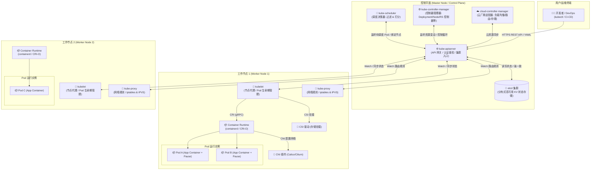
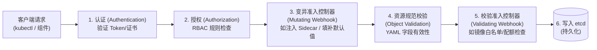
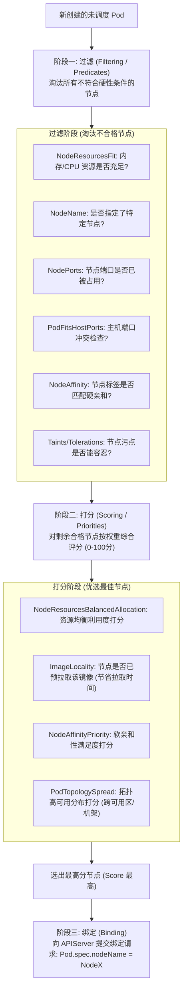
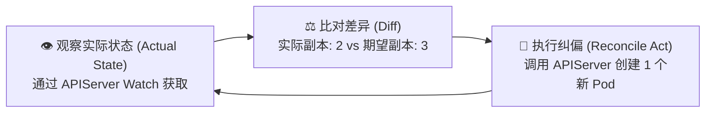
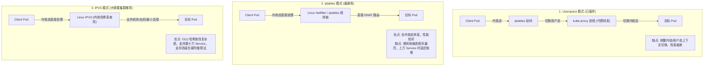
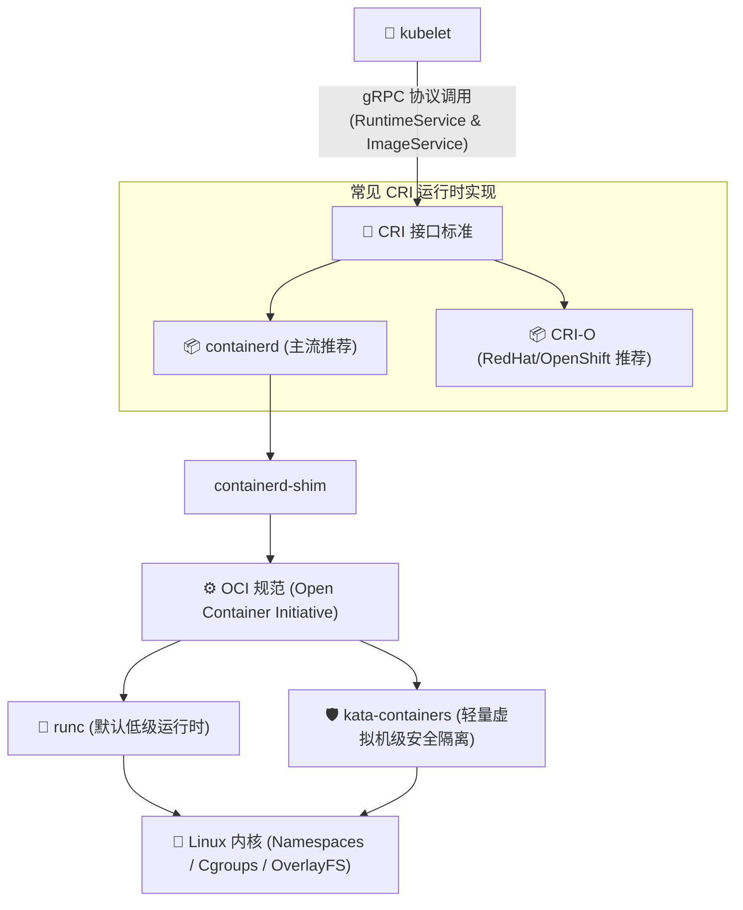
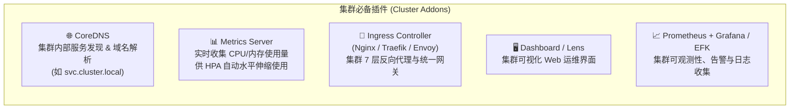
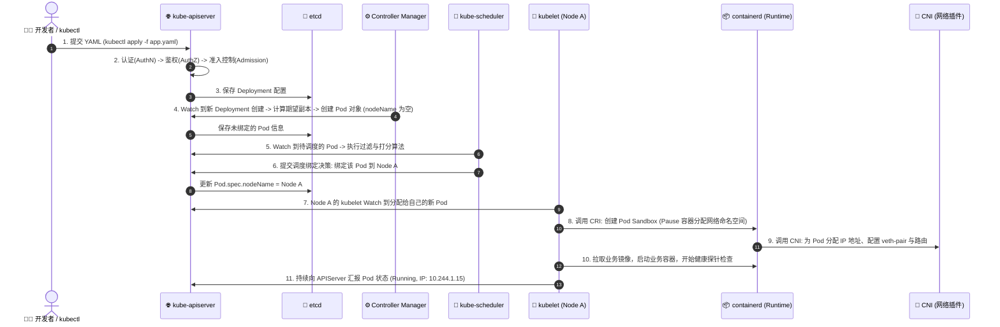
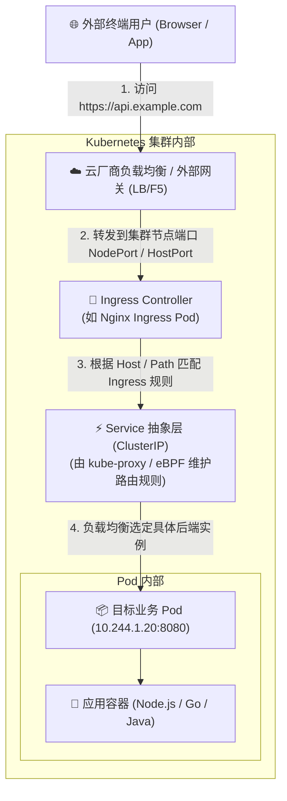

# Kubernetes 核心架构与全模块深度解析指南

> 本文档全面解析 Kubernetes (K8s) 的设计理念、架构全景、控制平面与工作节点的每一个核心组件、三大插件标准（CRI/CNI/CSI）、核心附加组件（Addons），并通过 Mermaid 架构图和时序流程图拆解 Pod 的全生命周期与网络流量路径。

---

## 目录
1. [Kubernetes 核心理念与架构通俗比喻](#1-kubernetes-核心理念与架构通俗比喻)
2. [Kubernetes 整体架构全景图](#2-kubernetes-整体架构全景图)
3. [控制平面组件（Master Node）深度剖析](#3-控制平面组件master-node深度剖析)
   - [3.1 kube-apiserver（集群通信枢纽与 API 网关）](#31-kube-apiserver集群通信枢纽与-api-网关)
   - [3.2 etcd（分布式强一致性状态数据库）](#32-etcd分布式强一致性状态数据库)
   - [3.3 kube-scheduler（Pod 调度决策大脑）](#33-kube-schedulerpod-调度决策大脑)
   - [3.4 kube-controller-manager（自动化控制中枢）](#34-kube-controller-manager自动化控制中枢)
   - [3.5 cloud-controller-manager（云平台集成大脑）](#35-cloud-controller-manager云平台集成大脑)
4. [工作节点组件（Worker Node）深度剖析](#4-工作节点组件worker-node深度剖析)
   - [4.1 kubelet（节点总执行官/大管家）](#41-kubelet节点总执行官大管家)
   - [4.2 kube-proxy（网络路由与负载均衡代理）](#42-kube-proxy网络路由与负载均衡代理)
   - [4.3 Container Runtime（容器运行时与 CRI 架构）](#43-container-runtime容器运行时与-cri-架构)
5. [三大标准化插件接口（K8s 的乐高积木）](#5-三大标准化插件接口k8s-的乐高积木)
   - [5.1 CRI（Container Runtime Interface）](#51-cricontainer-runtime-interface)
   - [5.2 CNI（Container Network Interface）](#52-cnicontainer-network-interface)
   - [5.3 CSI（Container Storage Interface）](#53-csicontainer-storage-interface)
6. [核心附加组件（Cluster Addons）](#6-核心附加组件cluster-addons)
7. [核心业务全链路时序图解](#7-核心业务全链路时序图解)
   - [7.1 从 `kubectl apply` 到 Pod 运行的 10 步全生命周期](#71-从-kubectl-apply-到-pod-运行的-10-步全生命周期)
   - [7.2 外部网络流量访问 Pod 的完整路径](#72-外部网络流量访问-pod-的完整路径)
8. [核心组件全景速查对照表](#8-核心组件全景速查对照表)

---

## 1. Kubernetes 核心理念与架构通俗比喻

如果把整个 Kubernetes 集群比作一个**现代化的智慧跨国货运物流舰队**：

* **Master 节点（控制平面）** 就是 **舰队总指挥部 / 市政指挥中心**；
* **Worker 节点（工作节点）** 就是 **实际执行运输任务的货船 / 制造工厂**；
* **Pod** 是 **标准集装箱（最小调度单元，里面可以放一个或多个紧密协作的货物/容器）**；
* **Container（容器）** 是 **集装箱里的具体货物与工人**。

### 各模块角色比喻表
| 模块名称 | 角色比喻 | 一句话核心职责 |
| :--- | :--- | :--- |
| **kube-apiserver** | **总指挥部唯一的前台接发大厅 / 总秘书处** | 所有的指令、查询都必须经过它，负责身份认证、权限检查和分发指令。 |
| **etcd** | **国家档案馆 / 绝密总账本** | 记录整个舰队所有船舶、集装箱状态的唯一真实数据库，数据绝对可靠。 |
| **kube-scheduler** | **智能调度中心 / 货运规划师** | 根据货物重量（CPU/内存需求）和船舶空闲度，决定集装箱应该放到哪艘船上。 |
| **kube-controller-manager** | **全天候自动监察巡逻队 / 状态纠偏官** | 时刻检查“实际现状”是否符合“期望状态”（比如要求3个副本，死了一个立刻补一个）。 |
| **kubelet** | **每艘船上的船长 / 工厂厂长** | 接收总部的任务清单，指挥船上的工人搬运、启动集装箱，并向总部汇报船舶健康。 |
| **kube-proxy** | **船内/船际导航员与交通警察** | 负责船只和集装箱之间的网络寻址、负载均衡与流量转发。 |
| **Container Runtime** | **船舱里的吊车与工人（如 containerd）** | 真正负责拉取镜像、解压、启动和杀死容器的底层工具。 |

---

## 2. Kubernetes 整体架构全景图

Kubernetes 采用典型的**主从架构（Master-Worker）**，分为**控制平面（Control Plane）**与**工作节点（Worker Nodes）**。

### 2.1 高清架构矢量全景图 (Diagram Design)

<iframe src="./k8s-architecture-overview.svg" width="100%" height="600px" style="border: 1px solid #e2e8f0; border-radius: 8px; margin: 16px 0; background-color: #f8fafc;" frameborder="0"></iframe>



---

## 3. 控制平面组件（Master Node）深度剖析

控制平面是 Kubernetes 的大脑，负责整个集群的全局决策（如调度）、检测和响应集群事件（如副本数不足时启动新 Pod）。

---

### 3.1 kube-apiserver（集群通信枢纽与 API 网关）

`kube-apiserver` 是控制平面中唯一直接与 `etcd` 进行交互的组件，也是集群所有组件（无论是内部控制器、调度器、kubelet，还是外部的 kubectl）通信的**唯一中央网关**。

#### 核心职责
1. **统一 API 入口**：暴露符合 RESTful 规范的 HTTPS 接口，支持 JSON/Protobuf 格式传输。
2. **安全防护三道门**：
   * **认证（Authentication）**：确认“你是谁”（支持 X.509 客户端证书、Bearer Token、OIDC、Webhook 等）。
   * **授权（Authorization）**：确认“你能干什么”（支持 RBAC 基于角色的访问控制、ABAC、Node 授权等）。
   * **准入控制（Admission Control）**：请求落库前的“安全合规检查与拦截修改”。
3. **数据持久化代理**：将合法的资源配置写入 etcd，或从 etcd 查询状态返回给调用方。
4. **高效事件通知（Watch 机制）**：基于 HTTP Chunked / HTTP/2 协议实现的长连接监听，当集群资源发生增删改时，能够实时（毫秒级）推送到监听该资源的组件。

#### APIServer 请求处理流水线



> **高可用特性**：`kube-apiserver` 是完全无状态的，生产环境中通常部署多个实例，前端挂载四层/七层负载均衡器（如 HAProxy + Keepalived 或云厂商 SLB），实现水平伸缩与高可用。

---

### 3.2 etcd（分布式强一致性状态数据库）

`etcd` 是基于 **Raft 强一致性算法** 构建的分布式高可用键值存储系统，保存了 Kubernetes 集群的**所有元数据、配置与运行状态（Single Source of Truth）**。

#### 核心设计机制
1. **Raft 算法一致性保证**：Leader 选举与日志复制机制，保证即便部分节点宕机，数据也不会丢失或出现脑裂。集群节点数必须为**奇数**（生产环境通常为 3 或 5 个节点），容忍 `(N-1)/2` 个节点宕机。
2. **MVCC（多版本并发控制）**：每次数据修改都会递增全局版本号（`Revision`），支持乐观锁并发控制（CAS，Compare-And-Swap），防止并发冲突。
3. **Watch 机制**：客户端可以监听特定的 Key 或目录前缀。当该 Key 变化时，etcd 立即将最新数据推给客户端。
4. **Lease（租约）与心跳**：用于节点注册、健康检查和领导者选举（如分布式锁），租约过期未续期则键值自动清理。

#### 为什么只有 APIServer 能直连 etcd？
```
❌ 禁止：Controller/Scheduler/Kubelet ---> etcd (直连会导致权限失控、连接爆炸、校验绕过)
✅ 规范：所有组件 ---> kube-apiserver ---> etcd
```
APIServer 扮演了 etcd 的“安全门卫”和“缓存屏障”，避免并发连接耗尽 etcd 资源，并统一施加数据校验和 RBAC 鉴权。

---

### 3.3 kube-scheduler（Pod 调度决策大脑）

`kube-scheduler` 负责监视新创建但尚未分配运行节点的 Pod（即 `spec.nodeName` 为空的 Pod），并根据一系列复杂的调度算法，为该 Pod 选择一个**最合适**的工作节点。

#### 两阶段调度流程



#### 常见调度高级策略
* **NodeSelector / NodeAffinity**：节点标签亲和（硬策略 `requiredDuringScheduling...` / 软策略 `preferredDuringScheduling...`）。
* **PodAffinity / PodAntiAffinity**：Pod 间亲和（把紧密关联的 Pod 放在一起）与反亲和（把副本分散到不同机器防止单点故障）。
* **Taints（污点）与 Tolerations（容忍）**：节点主动排斥 Pod（如 Master 节点打上 `NoSchedule` 污点，专用 GPU 机器打上专属污点）。
* **PriorityClass & Preemption（优先级与抢占）**：高优先级 Pod 资源不足时，调度器会主动驱逐低优先级 Pod 腾出资源。

---

### 3.4 kube-controller-manager（自动化控制中枢）

`kube-controller-manager`（简称 KCM）是集群各种自动化控制器的集合体。在 Kubernetes 中，一切皆为**“声明式设计（Declarative API）”**。

#### 核心机制：控制循环（Reconcile Loop）
每个控制器不断执行以下死循环：
$$\text{Observe (观察实际状态)} \longrightarrow \text{Diff (比对期望状态)} \longrightarrow \text{Act (执行纠偏操作)}$$



#### 核心内置控制器深度剖析
1. **Deployment & ReplicaSet Controller**：
   * 维护期望的 Pod 副本数量；
   * 实现**平滑滚动升级（Rolling Update）**、金丝雀发布与版本回滚。
2. **Node Lifecycle Controller**：
   * 负责节点的注册、监控与健康检查；
   * 当节点失联超过容忍时间（默认 5 分钟），自动将该节点上的 Pod 标记为 Terminating 并在其他健康节点上重建。
3. **EndpointSlice / Endpoints Controller**：
   * 监听 Service 与 Pod 的生命周期，自动将符合标签选择器（Label Selector）的 Pod IP 注册到 Service 的端点列表中。
4. **Job / CronJob Controller**：
   * 负责单次批处理任务的启动与退出判定；
   * 负责定时任务按 Cron 表达式触发创建 Job。
5. **Namespace Controller**：
   * 当 Namespace 被删除时，负责清理该命名空间下的所有资源。
6. **Garbage Collector (GC) Controller**：
   * 负责孤儿对象清理与**级联删除**（如删除 Deployment 时，自动清理其名下的 ReplicaSet 与 Pod）。

---

### 3.5 cloud-controller-manager（云平台集成大脑）

为了将 Kubernetes 核心代码与各大云厂商（AWS、阿里云、腾讯云、GCP 等）解耦，K8s 引入了 `cloud-controller-manager` (CCM)。

#### 核心控制器
* **Node Controller**：从云厂商 API 查询该节点虚拟机是否已被云端销毁。
* **Route Controller**：在底层云 VPC 路由器中配置容器网段的路由表。
* **Service Controller**：当用户创建 `type: LoadBalancer` 的 Service 时，自动向云厂商申请创建一个公网/内网负载均衡器（如 AWS ELB / 阿里云 SLB）。

---

## 4. 工作节点组件（Worker Node）深度剖析

工作节点（Worker Node）是集群中具体承担容器负载的计算实体。

---

### 4.1 kubelet（节点总执行官/大管家）

`kubelet` 是运行在每个 Worker 节点上的主要“代理人”。它不管理整个集群，而是专注于**本节点上的 Pod 与容器生命周期管理**。

#### 核心职责
1. **Pod 规范同步（PodSpec）**：
   * kubelet 定期通过 APIServer 获取分配到本节点的 Pod 清单；
   * 将 PodSpec 翻译为具体的容器运行时调用。
2. **PLEG 机制（Pod Lifecycle Event Generator）**：
   * 周期性检查本节点容器状态，并将容器生命周期事件（启动、退出、崩溃）汇总后向 APIServer 汇报。
3. **健康检查探针执行（Probes）**：
   * **StartupProbe（启动探针）**：判断容器应用是否已启动成功，未通过前禁用其他探针。
   * **LivenessProbe（存活探针）**：检测应用是否陷入死锁或崩溃，失败则触发容器重启。
   * **ReadinessProbe（就绪探针）**：检测应用是否准备好接收外部流量，失败则将其 IP 从 Service 端点中移除。
4. **节点资源管理与驱逐（Eviction）**：
   * 与内核 `cgroups` 协作限制 Pod 的资源使用量（Requests / Limits）；
   * 当节点内存或磁盘空间达到危险水位（如内存不足 10%），按优先级与超额度主动驱逐 Pod 保护宿主机。
5. **内嵌 cAdvisor**：自动收集本节点及所有容器的 CPU、内存、网络、磁盘 I/O 等实时监控指标。

---

### 4.2 kube-proxy（网络路由与负载均衡代理）

`kube-proxy` 是运行在每个节点上的网络代理组件。它负责实现 **Kubernetes Service（虚拟服务 IP / ClusterIP）** 到后端多个 Pod 实例的负载均衡和流量转发。

#### 三代工作模式演进与对比



> **现代演进趋势（eBPF）**：在最新一代云原生网络插件（如 Cilium）中，通常直接利用 Linux 内核 **eBPF (Extended Berkeley Packet Filter)** 技术绕过 iptables 和 kube-proxy，实现接近原生物理网络线速的转发。

---

### 4.3 Container Runtime（容器运行时与 CRI 架构）

容器运行时是具体负责**拉取镜像、解压镜像层、配置 cgroups/namespace、创建和运行容器**的底层软件。

#### 架构分层：从 Docker 垄断到 CRI 规范解耦

早期的 Kubernetes 与 Docker 强绑定，后来为了支持更多运行时（如 Kata 安全容器、runc 等），官方定义了 **CRI（Container Runtime Interface）** 统一标准。



---

## 5. 三大标准化插件接口（K8s 的乐高积木）

Kubernetes 之所以具备极强的生态扩展能力，核心在于它定义了三大标准接口：**CRI、CNI、CSI**。

```
┌─────────────────────────────────────────────────────────────┐
│                      Kubernetes Core                        │
├───────────────────┬───────────────────┬─────────────────────┤
│   CRI (计算/容器)   │    CNI (网络)      │     CSI (存储)      │
├───────────────────┼───────────────────┼─────────────────────┤
│ • containerd      │ • Flannel         │ • Ceph (Rook)       │
│ • CRI-O           │ • Calico          │ • NFS Driver        │
│ • Kata Container  │ • Cilium (eBPF)   │ • AWS EBS / EBS CSI │
│                   │ • Kube-OVN        │ • 阿里云云盘 CSI    │
└───────────────────┴───────────────────┴─────────────────────┘
```

### 5.1 CRI（Container Runtime Interface）
* **定位**：解耦 kubelet 与容器运行时。
* **协议**：基于 gRPC，包含两大服务：
  1. `RuntimeService`：负责 Pod 与容器的生命周期管理（RunPodSandbox, StopPodSandbox, CreateContainer, StartContainer 等）；
  2. `ImageService`：负责镜像的拉取、查看与删除（PullImage, ListImages, RemoveImage）。

### 5.2 CNI（Container Network Interface）
* **定位**：解决 Kubernetes 网络的三大核心原则：
  1. **所有 Pod 拥有唯一的独立 IP 地址**；
  2. **所有 Pod 之间可以直接跨节点通信，无需做 NAT 网络地址转换**；
  3. **Node 与 Pod 之间可以直接通信**。
* **主流插件对比**：
  * **Flannel**：最简单，采用 VXLAN 封装 Overlay 网络，适合中小规模、对网络策略无严格要求的场景。
  * **Calico**：采用纯三层 BGP 路由方案，支持强大的 `NetworkPolicy`（Pod 间网络防火墙策略），性能优异。
  * **Cilium**：基于 Linux 内核 eBPF 技术，提供超高性能转发、深层七层可观测性（Hubble）与精细安全策略。

### 5.3 CSI（Container Storage Interface）
* **定位**：标准化第三方存储提供商（云盘、分布式存储、本地磁盘）接入 K8s 的流程。
* **核心生命周期**：
  $$\text{Provision (动态创建云盘)} \longrightarrow \text{Attach (将云盘挂载至宿主机)} \longrightarrow \text{Mount (将文件系统格式化并挂载进容器内部)}$$
* **K8s 存储资源三元组**：
  * **StorageClass（存储类）**：定义存储类型与后端驱动配置（如高效云盘、SSD）；
  * **PVC（PersistentVolumeClaim 存储声明）**：开发者申请存储的“需求清单”（如“我需要 50GB 读写存储”）；
  * **PV（PersistentVolume 实际存储卷）**：具体分配好的底层真实存储资源。

---

## 6. 核心附加组件（Cluster Addons）

除了核心组件外，一个功能完备的生产级 Kubernetes 集群还需要以下核心附加插件：



1. **CoreDNS**：为集群内所有的 Pod 提供内部 DNS 解析服务。例如：一个应用可以通过 `http://user-service.default.svc.cluster.local:8080` 直接访问另外一个服务，无需关心其实际 Pod IP。
2. **Metrics Server**：从节点 kubelet (cAdvisor) 抓取资源使用率，存入内存，供 `kubectl top` 和 **HPA（Horizontal Pod Autoscaler，自动扩缩容）** 使用。
3. **Ingress Controller**：将集群外部的 HTTP/HTTPS 流量按域名和 URL 路由分发到集群内部的不同 Service。

---

## 7. 核心业务全链路时序图解

---

### 7.1 从 `kubectl apply` 到 Pod 运行的 10 步全生命周期

这是 Kubernetes 中最核心、最经典的工作流：

<iframe src="./k8s-pod-lifecycle-flow.svg" width="100%" height="520px" style="border: 1px solid #e2e8f0; border-radius: 8px; margin: 16px 0; background-color: #f8fafc;" frameborder="0"></iframe>



---

### 7.2 外部网络流量访问 Pod 的完整路径

外部用户如何通过域名一路访问到容器内部的应用？



---

## 8. 核心组件全景速查对照表

| 层次划分 | 组件名称 | 核心定位 | 通信协议 / 依赖 | 常见故障现象与排查方向 |
| :--- | :--- | :--- | :--- | :--- |
| **控制平面** | **`kube-apiserver`** | REST API 网关、认证鉴权、唯一读写 etcd 入口 | HTTPS (端口 6443) | `kubectl` 无法响应、证书过期（`x509: certificate has expired`）、6443 端口连接拒绝 |
| **控制平面** | **`etcd`** | 分布式强一致性状态数据库 | Raft 协议 / HTTP2 (2379/2380) | 磁盘 IOPS 不足导致 Leader 选举超时、集群只读（`etcdserver: leader changed`） |
| **控制平面** | **`kube-scheduler`** | 节点调度决策器（过滤 & 打分） | 与 APIServer 通信 | Pod 一直处于 `Pending` 状态，Events 提示 `0/N nodes available` |
| **控制平面** | **`kube-controller-manager`** | 声明式状态纠偏控制中枢 | 与 APIServer 通信 | 删除了 Pod 但没有自动重建、Deployment 滚动升级停滞卡住 |
| **工作节点** | **`kubelet`** | 节点管家，控制 Pod/容器生命周期 | gRPC (CRI/CSI), HTTPS (10250) | 节点状态变为 `NotReady`、无法创建容器、PLEG 线程超时（`PLEG is not healthy`） |
| **工作节点** | **`kube-proxy`** | 节点网络转发代理，实现 Service VIP | iptables / IPVS / eBPF | Service ClusterIP ping 不通（正常）、无法访问服务端口、负载均衡不均 |
| **工作节点** | **`containerd / CRI-O`** | 容器底层运行时 | CRI (gRPC), OCI (runc) | 镜像拉取失败（`ImagePullBackOff`）、容器启动崩溃（`CrashLoopBackOff`） |
| **基础插件** | **`CoreDNS`** | 集群内部 DNS 服务发现 | UDP/TCP 53 | 容器内无法通过服务名解析 IP、域名解析延迟高达 5 秒（`ndots:5` 配置问题） |
| **基础插件** | **`CNI (Calico/Cilium)`** | 容器跨主机网络连通与安全策略 | VXLAN / BGP / eBPF | 跨节点 Pod 之间无法互通、Pod 无法获取到有效 IP |
| **基础插件** | **`CSI Driver`** | 动态存储卷挂载与管理 | gRPC | PVC 处于 `Pending` 状态、存储卷挂载失败（`VolumeMountFailed`） |

---

## 9. 总结：学习与理解 K8s 的核心心法

1. **“万物皆对象，声明式 API”**：你只需要在 YAML 中描述**“我想要什么（Desired State）”**，K8s 控制器会自动为你实现并永远维持该状态。
2. **“解耦与插件化”**：Master 与 Worker 解耦，控制逻辑与底层容器/网络/存储解耦（CRI、CNI、CSI）。
3. **“无直接耦合，只看 APIServer”**：组件之间彼此不直接打电话，全部通过 APIServer 的 **Watch 机制** 异步监听和协作。
