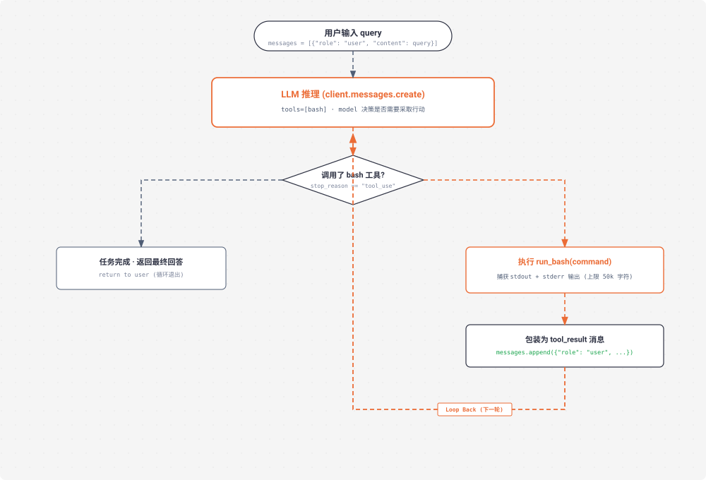

# s01 深度解析：Agent Loop 最小内核循环

> **核心格言**：*“One loop & Bash is all you need”* —— 一个工具 + 一个循环 = 一个 Agent。  
> **架构定位**：Harness 层的**极简闭环内核**，将大模型从静态文本补全升级为持续行动的智能体。 

---

## 🌟 动态全景流转图 (Animated Agent Loop)

<div align="center">
  
</div>

---

## 一、为什么必须有 s01？（设计动机）

大模型（LLM）本身只是一个函数：输入一段文本，输出一段文本。
如果你对模型说：“帮我看一下目录下的文件并执行测试”，模型能写出一条 `bash` 命令，但它自己**不会跑**，也**看不到结果**。

在没有 Agent Loop 之前：
* 你必须人肉把命令复制到终端跑一遍；
* 把输出结果复制回网页对话框；
* 每一个来回，**人类都在充当低效的中间层（Human Glue）**。

**s01 的核心**：用 30 行 Python 代码建立自动化闭环：模型决定调工具 → Harness 执行工具 → 结果喂回模型 → 触发下一轮思考，直到模型说“做完了”为止！

---

## 二、核心代码实现剖析

```python
# s01_agent_loop/code.py 核心精要

def agent_loop(messages: list):
    while True:
        # 1. 带着所有历史消息和工具定义请求 LLM
        response = client.messages.create(
            model=MODEL, system=SYSTEM,
            messages=messages, tools=TOOLS, max_tokens=8000,
        )
        messages.append({"role": "assistant", "content": response.content})

        # 2. 检查是否调用了工具；未调用说明回答完毕，安全退出
        if response.stop_reason != "tool_use":
            return

        # 3. 遍历执行工具并将输出打包为 tool_result
        results = []
        for block in response.content:
            if block.type == "tool_use":
                output = run_bash(block.input["command"])
                results.append({
                    "type": "tool_result",
                    "tool_use_id": block.id,
                    "content": output,
                })

        # 4. 把工具执行结果追加回 messages，开启下一轮 while True
        messages.append({"role": "user", "content": results})
```

---

## 三、Claude Code (CC) 源码映射

在真实的 Claude Code（`query.ts` 1729 行）中：
* **核心骨架完全一致**：生产级代码的核心就是上面这 30 行 `while True`。
* **差异点**：CC 不完全依赖 `stop_reason == "tool_use"`（因为在流式响应中该字段可能延迟更新），而是直接检查流式接收到的数据块中是否出现了 `tool_use` 块作为继续循环的信号。

---

## 🎯 总结与启示

* **循环属于 Agent，机制属于 Harness**。
* 后面所有的章节（S02 到 S20），全部都是在这个基础循环的周围叠加安全、规划、隔离与扩展机制，**这个核心循环本身永远不变**！
