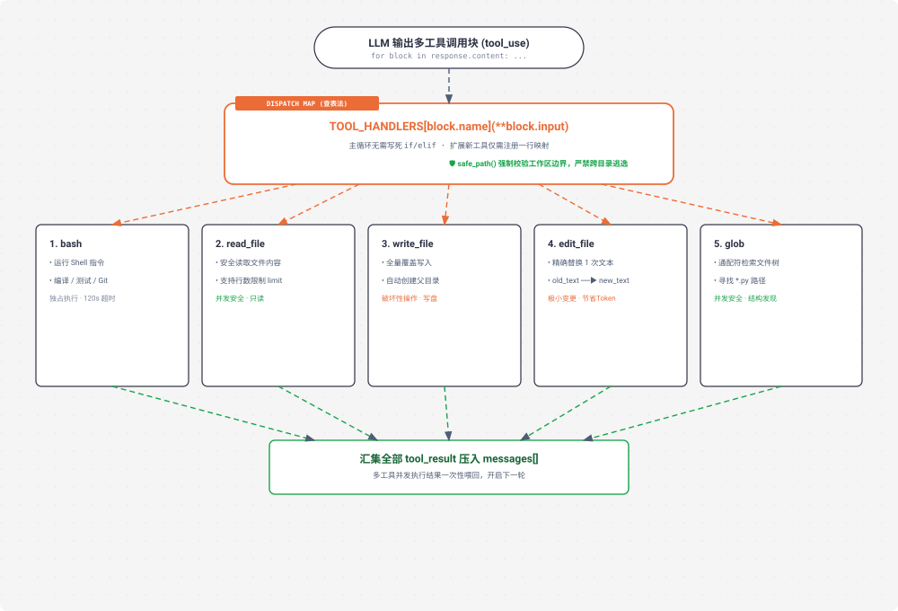

# s02 深度解析：Tool Use 查表分发与原子工具箱

> **核心格言**：*“加一个工具，只加一个 handler”* —— 循环不用动，新工具注册进 dispatch map 就行。  
> **架构定位**：Harness 层的**工具分发调度中枢（Dispatch Map）**与标准原子工具库。 

---

## 🌟 动态全景流转图 (Animated Tool Dispatch Map)

<div align="center">
  
</div>

---

## 一、为什么必须有 s02？（设计动机）

在 `s01` 中，Agent 手里只有 `bash` 一个工具：
* 想读文件？用 `cat file.py`；
* 想写文件？用 `echo "..." > file.py`（极易被引号和多行转义符号搞崩）；
* 想改一行代码？用 `sed`（语法晦涩且跨平台不兼容）。

**问题核心**：单一的 Bash 极度容易产生语法转义错误与安全越界。
**s02 的解法**：
1. 打造 5 个标准原子工具：`read_file`、`write_file`、`edit_file`、`glob`、`bash`；
2. 引入 `safe_path()` 沙箱限制，严禁读写跨越当前工作区；
3. 引入 **查表分发字典（`TOOL_HANDLERS`）**，让主循环对工具的增删彻底解耦。

---

## 二、关键代码实现剖析

```python
# s02_tool_use/code.py 核心精要

# 1. 路径安全沙箱
def safe_path(p: str) -> Path:
    path = (WORKDIR / p).resolve()
    if not path.is_relative_to(WORKDIR):
        raise ValueError(f"Path escapes workspace: {p}")
    return path

# 2. 查表分发映射字典 (Dispatch Map)
TOOL_HANDLERS = {
    "bash": run_bash,
    "read_file": run_read,
    "write_file": run_write,
    "edit_file": run_edit,
    "glob": run_glob,
}

# 3. agent_loop 核心分发调用
def agent_loop(messages: list):
    # ... 模型推理 ...
    for block in response.content:
        if block.type == "tool_use":
            # 查表分发，无需任何 if-elif 链条！
            handler = TOOL_HANDLERS.get(block.name)
            output = handler(**block.input) if handler else f"Unknown tool: {block.name}"
            results.append({"type": "tool_result", "tool_use_id": block.id, "content": output})
```

---

## 三、Claude Code (CC) 源码映射

在真实的 Claude Code（`StreamingToolExecutor.ts`）中：
* **并发安全分级（Concurrency Safety）**：
  * **只读工具（Read / Glob / Grep）**：被标记为 `isConcurrencySafe: true`，当大模型单次请求同时调用 5 个读取工具时，CC 会通过 `Promise.all` 真正并发执行；
  * **修改工具（Write / Edit / Bash）**：被标记为独占工具，按序串行执行，杜绝数据竞争。

---

## 🎯 总结与启示

* **开闭原则的第一次胜利**：循环骨架一行不改，增加新能力只需在字典里多加一行映射！
