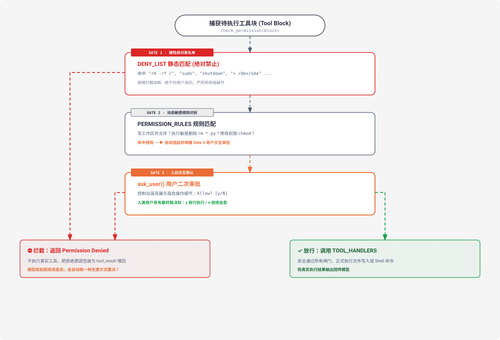

# s03 深度解析：Permission 权限管线与三道安全闸门

> **核心格言**：*“先划边界，再给自由”* —— 静态黑名单拦截、动态规则识别与用户二次确认。  
> **架构定位**：Harness 层的**安全护栏与信任边界引擎**，防止 Agent 执行高危破坏性动作。 

---

## 🌟 动态全景流转图 (Animated 3-Gate Permission Pipeline)

<div align="center">
  
</div>

---

## 一、为什么必须有 s03？（设计动机）

大模型虽然聪明，但它不知道物理现实的代价：
* 它可能会为了清理缓存执行 `rm -rf /`；
* 它可能会尝试修改宿主机的系统文件 `/etc/passwd`；
* 它可能会擅自覆盖当前工作区之外的重要配置文件。

**Harness 的责任**：在工具真正下发给操作系统执行之前，建立一套**确定性的三道安全防线**。

---

## 二、三道安全闸门机制

1. **Gate 1: 硬性黑名单 (Hard Deny List · 绝对禁止)**：
   * 静态关键词匹配（如 `sudo`, `shutdown`, `rm -rf /`, `mkfs`）；
   * 一旦命中立即硬性拦截，**绝不向用户询问**，杜绝误操作。
2. **Gate 2: 动态敏感规则 (Rule Matching · 风险识别)**：
   * 检查是否涉及写工作区外文件、普通 `rm` 命令、修改权限等敏感行为；
   * 命中后自动触发 Gate 3 挂起审批。
3. **Gate 3: 用户交互确认 (User Approval · 最终裁决)**：
   * 在控制台向人类弹窗展示操作细节 `Allow? [y/N]`；
   * 人类若拒绝，将拒绝理由作为 `tool_result` 喂回，**模型会自动换一种无害方式自愈重试**！

---

## 三、关键代码实现剖析

```python
# s03_permission/code.py 核心精要

DENY_LIST = ["rm -rf /", "sudo", "shutdown", "reboot", "mkfs", "dd if="]

PERMISSION_RULES = [
    {
        "tools": ["write_file", "edit_file"],
        "check": lambda args: not (WORKDIR / args.get("path", "")).resolve().is_relative_to(WORKDIR),
        "message": "Writing outside workspace"
    },
    {
        "tools": ["bash"],
        "check": lambda args: any(kw in args.get("command", "") for kw in ["rm ", "> /etc/", "chmod 777"]),
        "message": "Potentially destructive command"
    }
]

def check_permission(block) -> bool:
    # Gate 1: 查硬黑名单
    if block.name == "bash":
        for pattern in DENY_LIST:
            if pattern in block.input.get("command", ""):
                print(f"⛔ Blocked: '{pattern}' is on the deny list")
                return False

    # Gate 2 & Gate 3: 查敏感规则并向用户审批
    for rule in PERMISSION_RULES:
        if block.name in rule["tools"] and rule["check"](block.input):
            print(f"⚠ {rule['message']}: {block.name}({block.input})")
            choice = input("   Allow? [y/N] ").strip().lower()
            return choice in ("y", "yes")

    return True  # 安全操作直接放行
```

---

## 四、Claude Code (CC) 源码映射

在真实的 Claude Code（`PermissionManager.ts`）中：
* **会话级权限缓存（Session Approval Cache）**：当用户对某一类命令（如 `git status` 或 `npm test`）选择“Always Allow”后，当前 Session 自动放行该模式，大幅提升交互流畅度。
* **沙箱化运行（Sandbox Isolation）**：配合平台底层的 Docker / Seatbelt 沙箱，实现操作系统层面的双重隔离。

---

## 🎯 总结与启示

* **安全是自主 Agent 的第一前提**。
* 拒绝不是报错，而是引导模型走向正确解法的反馈信号。
