# s04 深度解析：生命周期与 Hook 拦截架构

> **核心格言**：*“挂在循环上，不写进循环里”* —— 扩展点不侵入核心主循环。  
> **架构定位**：Harness 层的事件驱动与插件化底座，实现生命周期与业务逻辑的彻底解耦。 

---

## 🌟 动态全景流转图 (Animated Lifecycle & Hook Pipeline)

<div align="center">
  
</div>

> 💡 **交互式演示提示**：如果你想手动单步调试（上一步/下一步）或体验自动播放演示，可直接在浏览器中打开交互式页面：  
> 👉 [`s04_hooks/images/hooks-lifecycle-animated.html`](./images/hooks-lifecycle-animated.html)

---

## 一、为什么必须有 s04？（设计动机）

在 `s03` 中，我们为 Agent 增加了权限控制（`check_permission`）。但随着 Agent 需要接入越来越多的生产能力，你很快会遇到**循环代码膨胀危机**：

```python
# ❌ 错误示范：把所有逻辑硬塞进核心主循环
def agent_loop(messages):
    while True:
        # ... 调用 LLM ...
        for block in response.content:
            if block.type != "tool_use":
                continue
            log_to_file(block)          # 加一行：日志审计
            check_permission(block)     # 加一行：权限检查
            notify_metrics(block)       # 又加一行：指标统计
            output = execute(block)
            auto_git_add(block)         # 再加一行：自动 Git 暂存
            check_output_size(output)   # 还要加一行：大输出告警
            # ... 很快循环就被污染得面目全非
```

### 痛点根源与设计原则
* **核心矛盾**：我们想要扩展的是 **Agent 的业务行为**，但每次动刀修改的却是 **核心主循环（Agent Loop）**。
* **Harness 设计原则**：**“挂在循环上，不写进循环里”**。主循环只负责维持基础的生命周期运转并按序分发事件；所有具体的权限判定、日志追踪、输出审计、上下文注入，全部作为 **Hook 回调** 挂载在外部。

---

## 二、4 大核心生命周期事件

整个 `s04` 围绕 Agent 的单次请求与工具循环，抽象出了覆盖全流程的 4 个核心拦截点：

| Hook 事件名 | 触发时机 | 传入参数 | 返回值语义约定 | 典型业务用途 |
| :--- | :--- | :--- | :--- | :--- |
| **`UserPromptSubmit`** | 用户刚输入 Query、进入 LLM 前 | `query: str` | 忽略 / 修改后的 Prompt | 注入当前工作区 CWD、环境元数据、输入合规审计 |
| **`PreToolUse`** | 某个工具**执行之前** | `block` (ToolUseBlock) | **非 `None` 立即拦截熔断**；`None` 放行 | 三道权限闸门（硬黑名单、高危指令、用户确认）、调用日志 |
| **`PostToolUse`** | 某个工具**执行之后** | `block, output` | 忽略 | 大文本输出告警、耗时统计、自动副作用（如 `git add`） |
| **`Stop`** | 模型未调工具，**即将退出时** | `messages: list` | **非 `None` 强制注入消息续跑**；`None` 允许退出 | 打印 Token/调用统计；检查任务完工度并驱动自愈续跑 |

---

## 三、全流程 7 步执行细节剖析 (Step-by-Step)

```
用户输入 query ──► [1. UserPromptSubmit] ──► [2. LLM 推理] ──► [3. 判定 tool_use?]
                                                                    │
                  ┌─────────────────────────────────────────────────┴──────────────────┐
                  ▼ (无工具调用)                                                        ▼ (有 tool_use)
            [Stop Hook]                                                         [4. PreToolUse]
                  │                                                                    │
         ┌────────┴────────┐                                                  ┌────────┴────────┐
         ▼                 ▼                                                  ▼                 ▼
   (强制续跑)        (退出并返回)                                         (放行执行)        (拦截 denied)
         │                                                                    │                 │
         │                                                            [5. 执行工具]             │
         │                                                                    │                 │
         │                                                            [6. PostToolUse]          │
         │                                                                    │                 │
         │                                                            [7. 组装 tool_result] ◄───┘
         │                                                                    │
         └────────────────────────────────────────────────────────────────────┴──► 循环回灌 LLM
```

---

## 四、核心基础设施：15 行 Hook 引擎

在 `s04/code.py` 中，整个事件注册与分发机制仅用了 15 行极简且优雅的代码：

```python
# 1. 全局事件注册中心
HOOKS = {
    "UserPromptSubmit": [],
    "PreToolUse": [],
    "PostToolUse": [],
    "Stop": []
}

# 2. 注册函数：向指定生命周期挂载回调
def register_hook(event: str, callback):
    HOOKS[event].append(callback)

# 3. 触发函数：链式顺序派发
def trigger_hooks(event: str, *args):
    for callback in HOOKS[event]:
        result = callback(*args)
        # 只要任意一个 hook 返回了非 None，表示触发了拦截/控制信号，提前熔断返回
        if result is not None:
            return result
    return None
```

---

## 🎯 总结与启示

1. **`agent_loop` 变成了稳固的引擎骨架**：它只负责跑 `while True`、调模型、触发钩子、回传结果，保持极度轻量与高稳定度。
2. **所有业务逻辑变成了可插拔插件**：无论是安全审计、权限审批、耗时监控还是大输出防护，随时增删改查，无需变动主循环一行核心代码。
