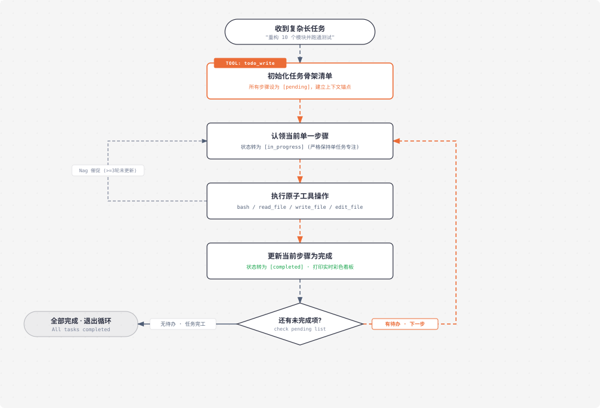

# s05 深度解析：TodoWrite 规划与状态锚点

> **核心格言**：*“没有计划的 agent 走哪算哪”* —— 先列步骤再动手，长任务完成率翻倍。  
> **架构定位**：Harness 层的**规划与注意力锚定系统**，防止大模型在长序列工具交互中注意力漂移（Attention Drift）。 

---

## 🌟 动态全景流转图 (Animated Todo State Machine)

<div align="center">
  
</div>

---

## 一、为什么必须有 s05？（设计动机）

给 Agent 一个复合任务：*“把所有 Python 文件改成 snake_case 命名，然后跑测试，修好所有失败。”*

在没有 `todo_write` 之前，Agent 的常见执行轨迹是：
1. 改了第 1 个文件，跑了测试，发现报错；
2. 开始排查测试报错，读了另外 3 个辅助文件；
3. **注意力漂移**：测试报错把它全部的 Attention 吸收了，它彻底忘记了最初的目标是*“把所有 Python 文件改成 snake_case”*；
4. 修复测试后，模型直接宣布任务完成，剩下 8 个未改名的文件直接被遗漏。

### 痛点根源
* **上下文稀释**：随着工具调用的输出不断塞入 `messages`，初始 System Prompt 和用户最初的目标在注意力权重上迅速衰减。
* **Harness 解法**：引入 `todo_write` 工具。**它不读写任何外部文件，不执行任何 shell 命令，它的唯一作用是在 Context 中不断刷新“当前进度骨架”**，把长任务锚定在有限的状态转换中。

---

## 二、核心数据结构与全量替换原则

### 1. `TodoItem` 状态模型
每个 Todo 项只有三种确定状态：
* `pending`：未开始
* `in_progress`：正在执行（**原则：同一时间通常只有一个任务处于此状态**）
* `completed`：已完成

```python
{
    "todos": [
        {"content": "扫描所有 python 文件并列出清单", "status": "completed"},
        {"content": "将 utils.py 变量重构为 snake_case", "status": "in_progress"},
        {"content": "将 helper.py 变量重构为 snake_case", "status": "pending"},
        {"content": "运行 pytest 并修复测试", "status": "pending"}
    ]
}
```

### 2. 全量替换（Full Replacement）设计
`todo_write` 每次传入的是 **整个任务清单的完整快照**，而不是局部增删改指令（比如 `add_todo` / `finish_todo(id)`）。
* **原因**：LLM 极其擅长重写列表，但在处理带 ID 引用、局部补丁更新时极易出现 ID 错乱或状态悬空。全量覆盖保证了 Harness 内存与模型意图绝对一致。

---

## 三、关键代码实现与 Nag 催促机制

```python
# s05_todo_write/code.py 核心精要

CURRENT_TODOS: list[dict] = []

def run_todo_write(todos: list) -> str:
    global CURRENT_TODOS
    CURRENT_TODOS = _normalize_todos(todos)

    # 在控制台以彩色字符格式化打印任务看板
    lines = ["\n## 📋 当前任务看板"]
    for t in CURRENT_TODOS:
        icon = {"pending": "⏸ ", "in_progress": "▶ ", "completed": "✓ "}.get(t["status"], "? ")
        lines.append(f"  [{icon}] {t['content']}")
    print("\n".join(lines))

    return f"Updated {len(CURRENT_TODOS)} tasks successfully."

# ── Nag Reminder 催促机制 ──
def agent_loop(messages: list):
    rounds_since_todo = 0

    while True:
        # 如果模型连续 3 轮执行工具却没有更新 TODO 状态，主动注入催促提示
        if rounds_since_todo >= 3 and messages:
            messages.append({
                "role": "user",
                "content": "<reminder>你已经连续 3 轮没有更新 TODO 了。请调用 todo_write 刷新当前进度并确认下一步。</reminder>"
            })
            rounds_since_todo = 0

        response = client.messages.create(...)
        # ... 工具分发逻辑 ...

        for block in response.content:
            if block.type == "tool_use":
                if block.name == "todo_write":
                    rounds_since_todo = 0  # 计数重置
                else:
                    rounds_since_todo += 1 # 计数累加
```

---

## 🎯 总结与启示

* **`todo_write` 增加的不是“能力（Capability）”，而是“自控力（Control）”**。
* 让 Agent 在复杂的迷宫中永远有一根红线牵引，解决了长任务“越做越偏、做完前面忘后面”的顽疾。
