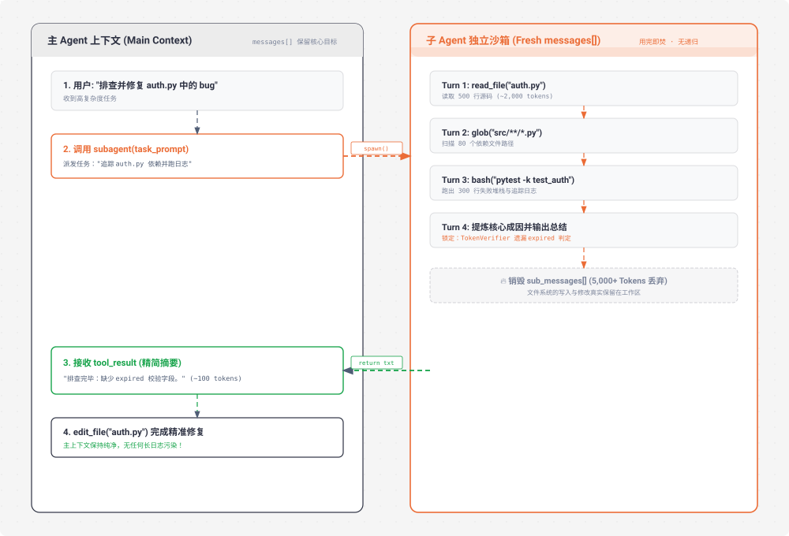

# s06 深度解析：Subagent 子智能体与上下文隔离

> **核心格言**：*“大任务拆小，每个小任务干净的上下文”* —— 子 Agent 用独立 `messages[]`，不污染主对话。  
> **架构定位**：Harness 层的**上下文降噪与分权执行系统**，防止主 Agent 记忆被中间搜索/排查垃圾淹没。 

---

## 🌟 动态全景流转图 (Animated Subagent Isolation)

<div align="center">
  
</div>

---

## 一、为什么必须有 s06？（设计动机）

当你让 Agent 去做一个深度的排查任务（例如：*“重现并定位这个罕见的竞争态 Bug”*），Agent 会做大量的读盘、搜索、运行脚本和输出日志。

* **没有 Subagent 时**：
  * 主上下文在短短 10 分钟内会塞入 50 次文件读取、几万行日志。
  * **主上下文被垃圾填满（Context Pollution）**，达到 Token 限制，而且核心任务目标被淹没在海量细节中。
* **引入 Subagent 后**：
  * 主 Agent 就像项目经理，派生一个实习生（Subagent）去翻阅海量日志。
  * 实习生翻完后，只给经理递交一份 **200 字的摘要结论**。
  * **实习生的整个临时聊天记录全部丢弃，但文件系统产生的修改（如创建的文件、测试代码）真实保留**。

---

## 二、Subagent 的三大核心规则

1. **全新干净的 `messages[]`**：
   * 子 Agent 启动时只传入当前派发任务的 `description` 作为它的第 1 条 user message，完全不继承主会话的历史包袱。
2. **工具权限受限（禁止无限递归）**：
   * 子 Agent 拥有基础的 `bash`, `read`, `write`, `edit`, `glob` 工具，但**不提供 `task / subagent` 工具**，防止 Agent 自行派生子子孙孙导致死循环或算力失控。
3. **安全 Hook 依然生效**：
   * 尽管上下文隔离了，但子 Agent 调用工具依然会流经 Harness 的 `PreToolUse` / `PostToolUse` 钩子，权限与安全防线不降级。

---

## 三、关键代码实现剖析

```python
# s06_subagent/code.py 核心精要

def spawn_subagent(description: str) -> str:
    """派生一个子 Agent 执行专注任务，只返回最终总结"""
    
    # 1. 准备受限的工具箱（剔除 subagent 工具本身）
    sub_tools = [t for t in TOOLS if t["name"] != "task"]
    
    # 2. 创建全新的独立消息列表
    sub_messages = [{"role": "user", "content": description}]
    
    # 3. 运行子 Agent 的独立主循环（带有安全轮次上限）
    for _ in range(30):
        response = client.messages.create(
            model=MODEL,
            system="You are a focused subagent. Perform the task directly. Return only the final summary.",
            messages=sub_messages,
            tools=sub_tools,
            max_tokens=8000,
        )
        sub_messages.append({"role": "assistant", "content": response.content})

        if response.stop_reason != "tool_use":
            break

        # 执行工具并回传子上下文
        results = []
        for block in response.content:
            if block.type == "tool_use":
                # 安全钩子依然生效
                blocked = trigger_hooks("PreToolUse", block)
                if blocked:
                    results.append({"type": "tool_result", "tool_use_id": block.id, "content": str(blocked)})
                    continue

                handler = TOOL_HANDLERS.get(block.name)
                output = handler(**block.input) if handler else "Unknown"
                trigger_hooks("PostToolUse", block, output)
                results.append({"type": "tool_result", "tool_use_id": block.id, "content": output})

        sub_messages.append({"role": "user", "content": results})

    # 4. 只提取最后一轮的文字总结，中间海量执行细节随 sub_messages 销毁
    return extract_final_text(sub_messages[-1]["content"])
```

---

## 🎯 总结与启示

* **隔离是保持大模型清醒的最佳手段**。
* 复杂任务的本质不是一次把所有事情做完，而是**把任务分解为若干个低耦合的上下文气室**，每个气室内部用完即焚，唯有成果通过 Harness 沉淀。
