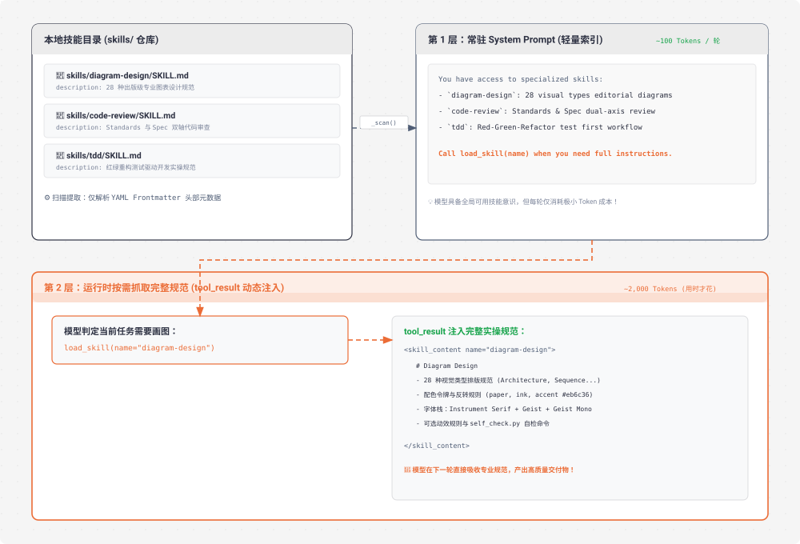

# s07 深度解析：Skill Loading 技能按需加载机制

> **核心格言**：*“用到时再加载，别全塞 prompt 里”* —— 通过 `tool_result` 注入知识，不占满 System Prompt。  
> **架构定位**：Harness 层的**专业领域知识按需检索与渐进式暴露系统**。 

---

## 🌟 动态全景流转图 (Animated Progressive Skill Disclosure)

<div align="center">
  
</div>

---

## 一、为什么必须有 s07？（设计动机）

假设你的企业团队有 20 份标准化工程规范：
* React 组件设计规范（2000 行）
* SQL 安全与索引指南（1500 行）
* 支付接口风控协议（3000 行）
* Git 分支管理与发布流（1000 行）

### 1. 传统全量堆叠的恶果（Brute-force Prompting）
如果全部硬编码写在 `SYSTEM = ...` 里：
* 每次调用模型必须强制携带 10,000+ Tokens 的无用规范；
* 哪怕用户只是问一句 *“帮我改个 CSS 颜色”*，也在消耗这 10,000 个 Token；
* 大量无关规范还会互相干扰，导致模型指令遵循能力下降。

### 2. Harness 的渐进式暴露哲学
* **启动阶段**：只读 `SKILL.md` 顶部的 YAML Frontmatter（名字 + 简述），生成极简目录放到 System Prompt。
* **执行阶段**：让 Agent 自己去判断 *“我当前是否需要这份技能”*。需要时，调用 `load_skill("name")` 将内容作为 `tool_result` 单次抓取。

---

## 二、Skill 目录与元数据规范

每个技能都是 `skills/` 下的一个标准目录，核心文件为 `SKILL.md`：

```markdown
---
name: code-review
description: Review code changes for standards compliance and specification alignment.
---

# Code Review Guide

## 审查轴向
1. Standards: 是否符合项目编码规范？
2. Spec: 是否满足需求规格说明？
...
```

---

## 三、核心代码实现：扫描与分发

```python
# s07_skill_loading/code.py 核心精要

SKILL_REGISTRY: dict[str, dict] = {}
SKILLS_DIR = Path("skills")

# 1. 启动时扫描技能目录，提炼 Frontmatter 索引
def scan_skills():
    if not SKILLS_DIR.exists():
        return
    for d in sorted(SKILLS_DIR.iterdir()):
        manifest = d / "SKILL.md"
        if manifest.exists():
            frontmatter, body = parse_frontmatter(manifest.read_text())
            name = frontmatter.get("name", d.name)
            SKILL_REGISTRY[name] = {
                "name": name,
                "description": frontmatter.get("description", ""),
                "body": body,
                "path": str(manifest)
            }

# 2. 将技能目录注入 System Prompt
def build_skills_system_prompt() -> str:
    lines = ["Available skills (call load_skill to read full instructions):"]
    for s in SKILL_REGISTRY.values():
        lines.append(f"  - `{s['name']}`: {s['description']}")
    return "\n".join(lines)

# 3. 按需加载工具实现
def run_load_skill(name: str) -> str:
    if name not in SKILL_REGISTRY:
        return f"Error: Skill '{name}' not found. Available: {list(SKILL_REGISTRY.keys())}"
    
    skill = SKILL_REGISTRY[name]
    return f"<skill_content name='{name}'>\n{skill['body']}\n</skill_content>"

TOOL_HANDLERS["load_skill"] = run_load_skill
```

---

## 四、Claude Code (CC) 源码深度映射

在真实的 Claude Code 生产源码中（`SkillTool.ts` / `SkillManager.ts`）：
1. **多层技能发现**：
   * 项目级技能：`./skills/` 或 `./.claude/skills/`
   * 用户全局技能：`~/.claude/skills/`
   * 企业分发技能：Plugin Marketplace / MCP 集成
2. **渐进式资产加载**：
   * 复杂的 Skill（如我们安装的 `diagram-design`）除了 `SKILL.md`，还包含 `references/` 细分文档。Skill 文档会引导 Agent 在需要时进一步用 `read_file` 查阅具体的子参考手册，实现“三级渐进加载”。

---

## 🎯 总结与启示

* **让 Agent 拥有自知之明（Awareness）**：它知道自己有哪些武器库，但不需要每时每刻把所有武器拿在手上。
* **按需索取是高 Token 经济性与高精准度的黄金法则**。
