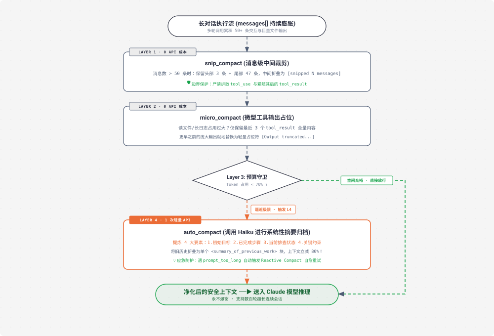

# s08 深度解析：Context Compact 四层阶梯式上下文压缩

> **核心格言**：*“上下文总会满，要有办法腾地方”* —— 四层压缩策略，便宜的先跑，贵的后跑。  
> **架构定位**：Harness 层的**长会话生命线与记忆压缩引擎**，保证 Agent 在超长复杂工程中永不爆窗（Context Exhaustion）。 

---

## 🌟 动态全景流转图 (Animated 4-Layer Compaction Pipeline)

<div align="center">
  
</div>

---

## 一、为什么必须有 s08？（设计动机）

当 Agent 深入复杂项目执行数十轮任务后：
* 一次 `read_file` 可能会吞掉 3,000 Tokens；
* 一次 `npm test` 失败栈追踪会产生 2,000 Tokens；
* `messages` 列表很快逼近 128k / 200k 极限。
* **直接后果**：API 直接抛出 `prompt_too_long` 拒绝响应，任务直接中断崩溃。

**Harness 的责任**：在进入 LLM 之前，必须有一套阶梯式的过滤净化管线，**动态腾出上下文空间**。

---

## 二、四层压缩机制深度剖析

### L1. 消息级裁剪（`snip_compact` · 0 成本）
* **逻辑**：对话超过 50 条时，早期交互（如 *“帮我创建 hello.py”*）与当前任务早已无关。
* **做法**：保留头部 3 条（初始指令与环境）和尾部 47 条（当前最新工作），中间折叠为一个占位符 `[snipped N messages]`。
* **关键边界防护（原子性）**：**绝对不能拆散 `tool_use` 与其紧接着的 `tool_result`**，否则会破坏大模型 API 的多轮消息协议。

### L2. 微型压缩（`micro_compact` · 0 成本）
* **逻辑**：即使消息条数没超标，但旧消息里可能躺着大量历史文件的全量内容。
* **做法**：保留最新的 3 个 `tool_result` 保持完整，把更早之前的庞大工具输出，就地替换为：
  `[Output truncated: earlier read_file content removed to save space]`

### L3. 预算守卫（`budget_compact` · 0 成本）
* **逻辑**：采用快速的字符估算算法（如 `len(text) // 4`），计算当前的 Token 占用。
* **判定**：若低于安全水位（如最大容量的 70%），直接放行进入 LLM；若逼近危险水位，才升级唤醒 L4。

### L4. 自动语义摘要（`auto_compact` · 1 次 API 成本）
* **逻辑**：前三层都压不住时，调用速度快、成本极低的模型（如 Claude 3.5 Haiku），对整个前半段历史进行**结构化归纳**。
* **提炼 4 大要素**：
  1. 最初的最终目标是什么？
  2. 已经完成了哪些步骤？
  3. 目前正在排查什么问题？
  4. 有哪些必须遵守的关键约束与环境变量？
* **重组**：将旧历史完全清除，替换为 `System: [Compact Summary: ...]`，上下文瞬间缩减 80%！

---

## 三、核心代码实现

```python
# s08_context_compact/code.py 核心精要

def compact_pipeline(messages: list, max_tokens: int = 80000) -> list:
    """四层阶梯式压缩管线：便宜的先跑，贵的后跑"""
    
    # Layer 1: 裁剪旧消息
    messages = snip_compact(messages, max_messages=40)
    
    # Layer 2: 占位旧的工具返回体
    messages = micro_compact(messages, keep_recent=3)
    
    # Layer 3: 计算预算
    current_tokens = estimate_tokens(messages)
    if current_tokens < max_tokens * 0.7:
        return messages  # 空间充裕，直接放行
    
    # Layer 4: 触发 LLM 摘要归档
    print("\033[33m[COMPACT] Context limit approaching. Running Auto-Compact...\033[0m")
    summary = generate_summary_with_haiku(messages[:-4])
    
    compacted_messages = [
        {"role": "user", "content": f"<summary_of_previous_work>\n{summary}\n</summary_of_previous_work>"},
        {"role": "assistant", "content": "Understood. I will continue from this summary."},
    ] + messages[-4:]  # 拼接最近 4 条保持连贯
    
    return compacted_messages
```

---

## 四、Claude Code (CC) 源码映射

在真实的 Claude Code 生产源码中（`compact.ts` / `autoCompact.ts`）：
1. **两阶段压缩触发**：
   * **Proactive Compact（主动预防）**：在每一轮请求前检查 Token 估算，超过 150k 时静默压缩。
   * **Reactive Compact（应急恢复）**：如果 API 依然意外返回了 `prompt_too_long`，CC 不会崩溃，而是捕获错误，立即执行最激进的 Micro-compact 重新重试请求。
2. **Haiku 异步预生成**：CC 甚至在后台利用闲置时间提前让 Haiku 总结旧历史，当需要 Compact 时实现 0 秒即时切换。

---

## 🎯 总结与启示

* **压缩不是粗暴地删聊天记录，而是一套严密的分级数据治理策略**。
* 守住“工具调用原子性”，先压细节（L1/L2）、再提炼语义（L4），是构建永久在线 Long-running Agent 的核心基石。
