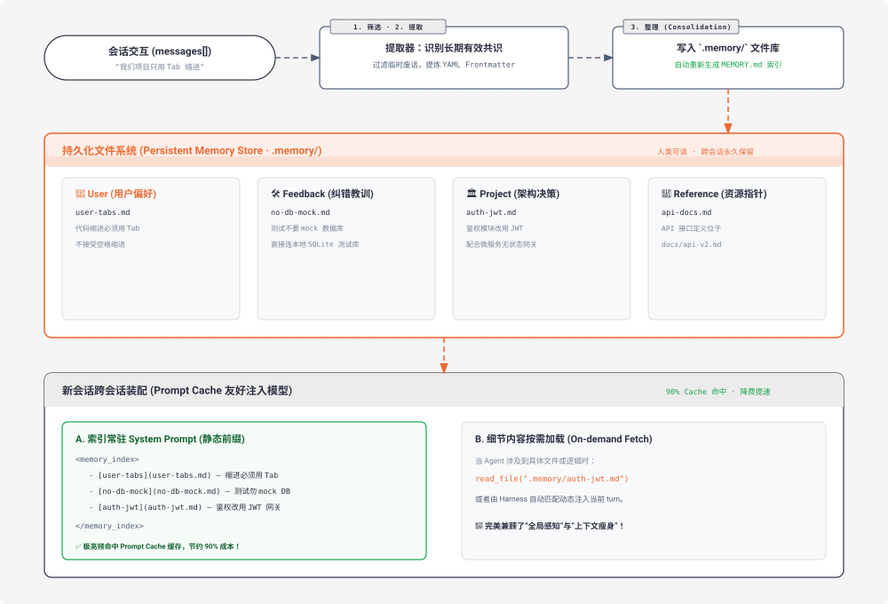

# s09 深度解析：Memory 跨会话长期记忆系统

> **核心格言**：*“压缩会丢细节，要有一层不丢的”* —— 文件仓库 + 索引 + 按需加载，跨越压缩与跨会话。  
> **架构定位**：Harness 层的**外置持久化记忆中枢**，解决上下文被压缩或重启后用户偏好与架构决策丢失的问题。 

---

## 🌟 动态全景流转图 (Animated Long-Term Memory Hub)

<div align="center">
  
</div>

---

## 一、为什么必须有 s09？（设计动机）

在 `s08` 中，上下文压缩解决了爆窗问题，但**压缩本质上是有损的**：
* 用户强调了：*“我们团队严格使用 Tab 缩进，绝不能用空格”*。
* 几轮之后经过 Auto-Compact，这句话被模糊提炼为 *“用户有特定的格式要求”*。
* **更致命的是**：当你关掉终端明天重新打开一个新 Session，昨天所有的讨论和背景全被清空。

**核心洞察**：模型本身是无状态的（Stateless），必须把长期不变的经验和规范**外置落盘到文件系统**，实现跨会话沉淀。

---

## 二、4 大记忆类型与结构化规范

记忆不是随意乱记，而是归纳为 4 个清晰的维度：

| 记忆类型 | 回答的核心问题 | 典型案例 |
| :--- | :--- | :--- |
| **`user`** | 用户是谁？有哪些不可违背的偏好？ | *“代码缩进必须用 Tab；变量命名遵循 PascalCase”* |
| **`feedback`** | 怎么做事？踩过什么坑被纠正过？ | *“单元测试不要 Mock 数据库，直接连本地 SQLite”* |
| **`project`** | 系统在发生什么？背后的架构决策是什么？ | *“鉴权模块之所以用 JWT 是为了配合微服务网关”* |
| **`reference`** | 关键资源和外部依赖去哪里找？ | *“API 接口文档位于 docs/api-v2.md”* |

### 文件规范示例：`.memory/user-tabs-preference.md`
```markdown
---
name: user-tabs-preference
description: 用户关于代码缩进使用 Tab 的严格偏好
type: user
---

用户要求在本仓库的所有代码修改中，缩进必须使用 Tab 而非空格。
- **原因**：保持与项目既有代码风格一致。
- **执行准则**：在创建和编辑任何新文件时，设置 tab_size=4 并保持制表符。
```

---

## 三、关键代码实现：索引与按需加载

```python
# s09_memory/code.py 核心精要

MEMORY_DIR = Path(".memory")
MEMORY_INDEX = MEMORY_DIR / "MEMORY.md"

def write_memory_file(name: str, mem_type: str, description: str, body: str):
    """写入单条记忆并刷新索引文件"""
    MEMORY_DIR.mkdir(exist_ok=True)
    slug = name.lower().replace(" ", "-")
    file_path = MEMORY_DIR / f"{slug}.md"
    
    content = f"""---
name: {slug}
description: {description}
type: {mem_type}
---

{body.strip()}
"""
    file_path.write_text(content)
    rebuild_memory_index()

def rebuild_memory_index():
    """重建 MEMORY.md 索引清单"""
    lines = ["# 🧠 长期记忆索引\n"]
    for f in sorted(MEMORY_DIR.glob("*.md")):
        if f.name == "MEMORY.md":
            continue
        frontmatter, _ = parse_frontmatter(f.read_text())
        desc = frontmatter.get("description", "")
        lines.append(f"- [{f.stem}]({f.name}) — {desc}")
    
    MEMORY_INDEX.write_text("\n".join(lines))

def get_memory_system_prompt() -> str:
    """将轻量索引常驻 System Prompt，不占过多 Token 且利于 Prompt Cache"""
    if not MEMORY_INDEX.exists():
        return ""
    return f"\n<memory_index>\n{MEMORY_INDEX.read_text()}\n</memory_index>"
```

---

## 四、Claude Code (CC) 源码深度映射

在真实的 Claude Code 生产源码中（`memory.ts` / `consolidate.ts`）：
1. **`CLAUDE.md` 与 Project Memory**：
   * CC 启动时会自动读取工作区根目录下的 `CLAUDE.md`，这其实就是最高优先级的持久化记忆。
2. **Prompt Cache 友好设计**：
   * 将高频稳定不变的 `MEMORY.md` 索引放在 System Prompt 前半部分，触发 Anthropic API 的 **Prompt Caching**（降低 90% 缓存读取费用）；
   * 具体的单条记忆文件则通过类似 Skill 的机制在当前轮按需注入，绝不破坏前文的 Cache 命中率。

---

## 🎯 总结与启示

* **真正的 Agent 越用越聪明**：它不会在每一次对话开始时都装作一个刚认识你的陌生人。
* **文件即记忆**：将知识以 Markdown 的形式保存在本地，人类既能直接肉眼审阅修改，模型也能自由读取更新，形成了最佳的人机共识载体。
