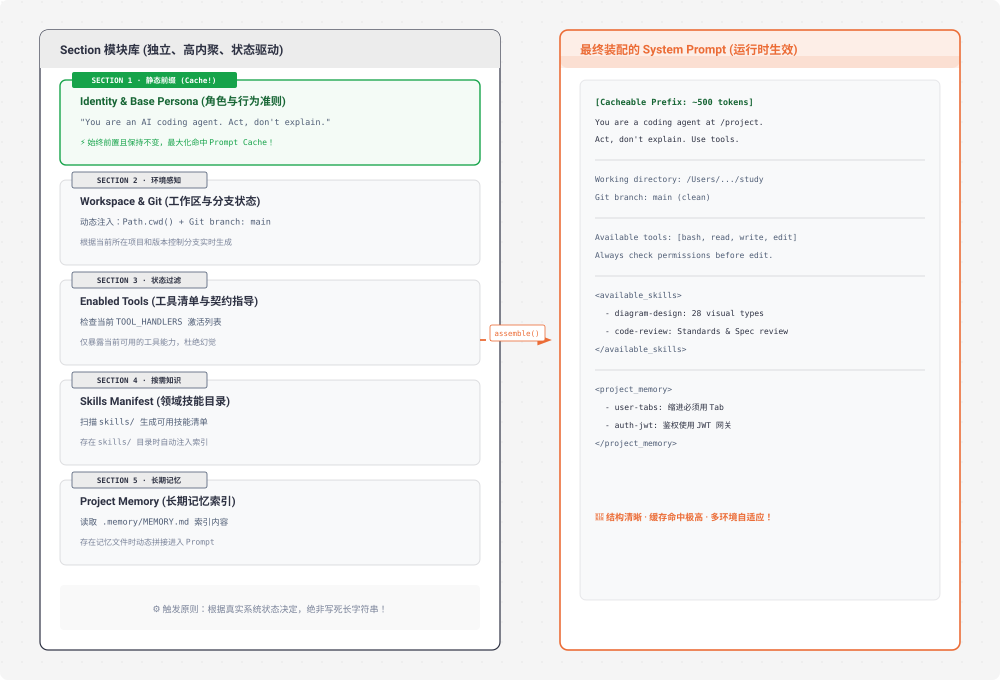

# s10 深度解析：System Prompt 运行时动态装配流水线

> **核心格言**：*“Prompt 是组装出来的，不是写死的”* —— 分段定义 + 状态驱动拼接 + 缓存优化。  
> **架构定位**：Harness 层的**提示词装配中枢**，将静态死板的字符串升级为可感知的运行时动态上下文管线。 

---

## 🌟 动态全景流转图 (Animated System Prompt Assembly Pipeline)

<div align="center">
  
</div>

---

## 一、为什么必须有 s10？（设计动机）

回顾从 `s01` 到 `s09`，我们的 System Prompt 往往是一个硬编码的拼接长字符串：

```python
# ❌ 硬编码的巨大静态字符串：维护噩梦
SYSTEM = (
    f"You are a coding agent at {WORKDIR}.\n"
    "Use tools to solve tasks. Act, don't explain.\n"
    "Before starting any task, use todo_write.\n"
    + get_skills_string()
    + get_memory_string()
    + "Rules: never run rm -rf, write tests first..."
)
```

### 这种做法的三大缺陷：
1. **多环境无法复用**：换一个操作系统（Linux vs Windows）、换一个项目目录，整段 Prompt 要推倒重写。
2. **缺乏状态感知**：如果当前环境没有安装 `git` 或没有某个工具，Prompt 里却写满了该工具的指令，诱导模型产生幻觉报错。
3. **彻底破坏 Prompt Cache**：随便修改中间一句话，或者动态时间戳一变，整个 System Prompt 的缓存全部失效，推理费用暴增 10 倍。

---

## 二、Section 模块化设计原则

在 `s10` 中，System Prompt 被拆分为多个**职责单一的独立 Section**，每个 Section 具备独立的加载条件与缓存策略：

| Section 名称 | 加载策略 | 判断依据 (State Trigger) | 缓存考量 |
| :--- | :--- | :--- | :--- |
| **`identity`** | 始终加载 | 基础系统角色设定 | **前置固定**，最大化命中 Prompt Cache |
| **`workspace`** | 始终加载 | 动态获取 `Path.cwd()` 及 Git 状态 | 保持相对稳定 |
| **`tools`** | 状态驱动 | 检查当前注册的 `TOOL_HANDLERS` 列表 | 仅列出真正可用的工具 |
| **`skills`** | 按需加载 | 检查 `skills/` 目录是否存在 `.md` 文件 | 仅在有技能时注入清单 |
| **`memory`** | 按需加载 | 检查 `.memory/MEMORY.md` 索引文件 | 仅在有记忆沉淀时注入 |

---

## 三、关键代码实现：动态装配引擎

```python
# s10_system_prompt/code.py 核心精要

class SystemPromptBuilder:
    def __init__(self, workdir: Path):
        self.workdir = workdir

    def build_identity_section(self) -> str:
        return "You are an expert AI coding agent powered by DeepSeek Harness. Act, don't explain."

    def build_workspace_section(self) -> str:
        branch = self._get_git_branch()
        return f"Working directory: {self.workdir}\nGit branch: {branch}"

    def build_tools_section(self, enabled_tools: list[str]) -> str:
        tool_lines = [f"- `{t}`" for t in enabled_tools]
        return "Available tool capabilities:\n" + "\n".join(tool_lines)

    def build_skills_section(self) -> str | None:
        if not Path("skills").exists():
            return None
        return build_skills_system_prompt()

    def build_memory_section(self) -> str | None:
        memory_index = Path(".memory/MEMORY.md")
        if not memory_index.exists():
            return None
        return f"<project_memory>\n{memory_index.read_text()}\n</project_memory>"

    def assemble(self, enabled_tools: list[str]) -> str:
        """按顺序装配所有有效 Section"""
        sections = [
            self.build_identity_section(),
            self.build_workspace_section(),
            self.build_tools_section(enabled_tools),
            self.build_skills_section(),
            self.build_memory_section(),
        ]
        # 过滤掉为 None 的空 Section，用双换行规范拼接
        return "\n\n".join(filter(None, sections))

# ── 在主循环中使用 ──
builder = SystemPromptBuilder(WORKDIR)
SYSTEM_PROMPT = builder.assemble(enabled_tools=list(TOOL_HANDLERS.keys()))
```

---

## 四、Claude Code (CC) 源码深度映射

在真实的 Claude Code 生产源码中（`systemPrompt.ts` / `promptBuilder.ts`）：
1. **严格的 Cache-Line 对齐**：
   * CC 将绝对不变的内容（Identity + Core Policy）放在最前端，形成 **Static Prefix**；
   * 将高频动态内容（当前时间、即时 Git Diff、单次输入注入）放在最末尾。
   * 这种布局保证了 **前 80% 的 Token 无论会话如何进行都能持续命中 Anthropic 的 Prompt Cache**。
2. **多模式 Prompt 切换**：
   * Plan 模式（架构设计与思考）与 Act 模式（代码编写与工具调用）在运行时自动切换不同的 System Prompt 模板组合。

---

## 🎯 总结与启示

* **Prompt 不是文心雕龙的静态美文，而是由环境感知驱动的结构化配置**。
* 模块化（Sectional）、状态感知（State-aware）和缓存优先（Cache-first）是现代生产级 Agent Harness Prompt 设计的三大核心支柱。
