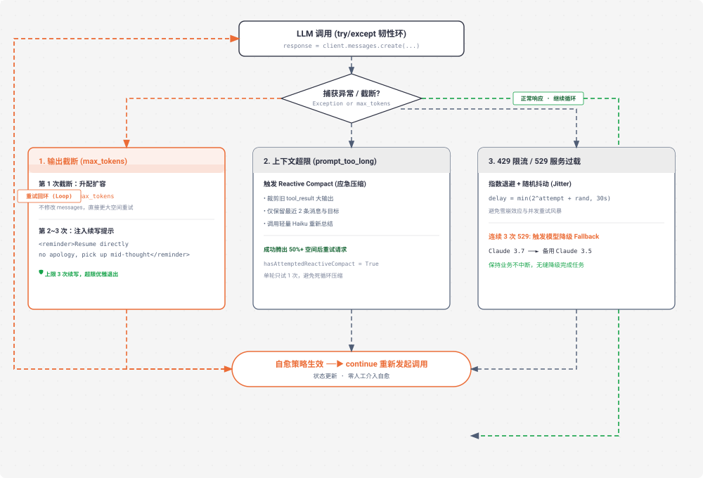

# s11 深度解析：Error Recovery 错误自愈与分级恢复架构

> **核心格言**：*“错误不是终点，是重试的起点”* —— 升级 Token、应急压缩、退避重试与模型降级。  
> **架构定位**：Harness 层的**高可用韧性防护网**，确保 Agent 在复杂的云环境与模型服务波动下具备自愈能力（Self-healing）。 

---

## 🌟 动态全景流转图 (Animated Error Recovery Topology)

<div align="center">
  
</div>

---

## 一、为什么必须有 s11？（设计动机）

在真实生产环境中，LLM API 报错是家常便饭：
* **529 Overloaded**：Anthropic / OpenAI 服务负载过高；
* **429 Rate Limit**：触发了 TPM（Token/Min）或 RPM 速率配额；
* **max_tokens 截断**：模型生成了超长代码，话说一半被 Token 上限硬生生切断；
* **prompt_too_long**：即便做过前置压缩，偶尔大输入仍可能导致瞬间爆窗。

在 `s01` ~ `s10` 中，一旦发生上述错误，Python 进程直接抛出异常崩溃退出，前面所有思考与工作全部泡汤。
**s11 的设计原则**：**把整个 LLM 调用包裹在状态机韧性环中**，根据不同故障类型采取精准的分级自愈策略，然后 `continue` 回环重试，实现全自动无人值守恢复。

---

## 二、三大经典故障自愈路径

### 路径 1：输出截断 (`stop_reason == "max_tokens"`)
* **第 1 次截断（升配扩容）**：
  * 将 `max_tokens` 从默认 8,000 直接升级到 **64,000**（8 倍容量）；
  * **关键设计**：此时**不把截断的内容追加到 `messages`**，保持原请求干净，直接使用 64K 配额原地重新请求。
* **第 2~3 次截断（续写提示注入）**：
  * 如果 64K 依然被截断，说明是超级长文本。将已有输出追加到 `messages`，并注入强约束续写指令：
    `<reminder>Output token limit hit. Resume directly — no apology, no recap. Pick up mid-thought.</reminder>`
  * 强制模型从断点继续往下写，绝不浪费 Token 说废话。上限 3 次，超限安全退出。

### 路径 2：上下文超限 (`prompt_too_long`)
* 触发 **Reactive Compact（应急压缩）**：
  * 清理所有旧的工具执行大结果（替换为占位符）；
  * 仅保留最近 2 条消息与初始目标；
  * 标记 `hasAttemptedReactiveCompact = True`（单轮仅触发一次，防止死循环），腾出 50%+ 空间后重试。

### 路径 3：临时故障 (`429 / 529`)
* **指数退避 + 随机抖动 (Exponential Backoff with Jitter)**：
  * 计算等待时延：`delay = min(2 ** attempt + random.uniform(0, 1), 30)`；
  * 避免高并发下的重试风暴与雪崩效应。
* **模型自动降级 (Fallback)**：
  * 如果主模型（如 Claude 3.7 Sonnet）连续 3 次报 529，自动无缝切换至备用模型（如 Claude 3.5 Sonnet / Haiku），保证业务不中断。

---

## 三、关键代码实现剖析

```python
# s11_error_recovery/code.py 核心精要

class RecoveryState:
    def __init__(self):
        self.max_tokens = 8000
        self.has_escalated = False
        self.recovery_count = 0
        self.consecutive_529 = 0
        self.current_model = MODEL

def call_llm_with_recovery(messages: list, state: RecoveryState):
    """带自愈恢复策略的 LLM 请求包装器"""
    while True:
        try:
            response = client.messages.create(
                model=state.current_model,
                system=SYSTEM_PROMPT,
                messages=messages,
                tools=TOOLS,
                max_tokens=state.max_tokens,
            )
            state.consecutive_529 = 0  # 成功，重置故障计数

            # 检查输出截断
            if response.stop_reason == "max_tokens":
                if not state.has_escalated:
                    print("\033[33m[RECOVERY] 输出截断，升配至 64K Token 重新发起请求...\033[0m")
                    state.max_tokens = 64000
                    state.has_escalated = True
                    continue  # 不污染 messages，直接重试
                
                # 64K 仍截断，注入续写指令
                messages.append({"role": "assistant", "content": response.content})
                if state.recovery_count < 3:
                    print("\033[33m[RECOVERY] 注入续写提示...\033[0m")
                    messages.append({
                        "role": "user",
                        "content": "Output limit reached. Continue directly mid-thought, no recap."
                    })
                    state.recovery_count += 1
                    continue
                return response  # 超限退出

            return response

        except Exception as e:
            err_str = str(e).lower()
            
            # 429 / 529 退避与降级
            if "529" in err_str or "overloaded" in err_str:
                state.consecutive_529 += 1
                if state.consecutive_529 >= 3 and state.current_model != FALLBACK_MODEL:
                    print(f"\033[31m[RECOVERY] 连续 3 次 529，降级切换至备用模型: {FALLBACK_MODEL}\033[0m")
                    state.current_model = FALLBACK_MODEL
                    continue

                backoff = min(2 ** state.consecutive_529 + random.uniform(0.1, 0.5), 30)
                print(f"\033[33m[RECOVERY] 服务过载，退避等待 {backoff:.1f}s 后重试...\033[0m")
                time.sleep(backoff)
                continue
            
            raise e  # 不可恢复错误正常向上抛出
```

---

## 🎯 总结与启示

* **单兵 Agent 的大成之作**：`s01` 到 `s11` 实现了单 Agent 从动手、分发、安全、扩展、规划、隔离、按需知识、压缩、记忆、装配到自愈的完整闭环！
* 下一阶段（`s12` ~ `s20`），我们将跨出单兵作战，迈入**长周期持久化任务系统与多 Agent 团队协同**的新天地！
