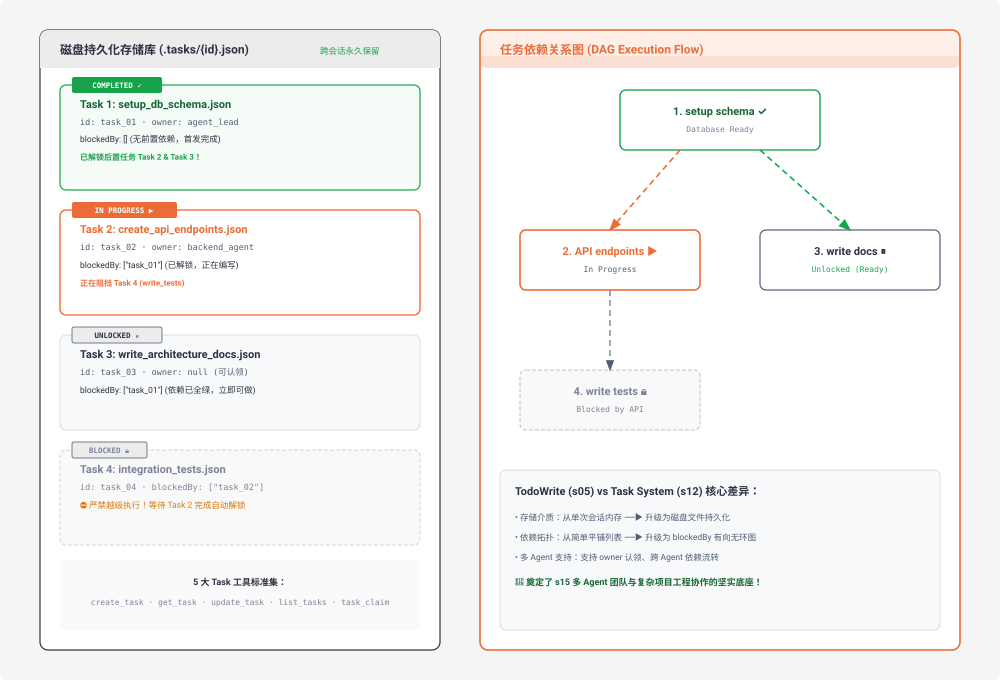

# s12 深度解析：Task System 磁盘持久化任务图与依赖管理

> **核心格言**：*“大目标拆成小任务，排好序，持久化”* —— 文件持久化的任务 DAG 图，多 Agent 协作的基础。  
> **架构定位**：Harness 层的**长任务持久化调度引擎**，实现任务在磁盘落盘、依赖自动解锁与跨会话状态复原。 

---

## 🌟 动态全景流转图 (Animated Task DAG & Persistence)

<div align="center">
  
</div>

---

## 一、为什么必须有 s12？（设计动机）

回顾 `s05` 的 `todo_write`：
* **局限性 1（生命周期短）**：TODO 存放在 Python 内存变量 `CURRENT_TODOS` 中，终端一旦重启或 Session 结束，清单彻底丢失。
* **局限性 2（缺乏拓扑依赖）**：TODO 只是一个线性一维列表，无法表达 *“任务 4 必须在 任务 2 完成后才能开始，但任务 3 可以和任务 2 并行”* 这种严格的工程依赖。
* **局限性 3（无法多 Agent 认领）**：无法标记每个任务由谁负责（`owner`），无法支撑团队并行协作。

**s12 的进化**：引入标准的 **Task System**，将每个任务持久化为一个独立的 `.tasks/{id}.json` 磁盘文件，通过 `blockedBy` 字段构建出完整的 **有向无环图 (DAG)**。

---

## 二、TodoWrite (s05) vs Task System (s12) 全方位对比

| 维度 | TodoWrite (s05) | Task System (s12) |
| :--- | :--- | :--- |
| **存储介质** | 内存变量（用完即丢） | 磁盘文件 `.tasks/{id}.json`（跨会话持久化） |
| **依赖关系** | 无，纯线性步骤 | `blockedBy` / `blocks` 有向无环图 (DAG) |
| **分工模型** | 单 Agent 自身备忘 | 支持 `owner` 标记与 `task_claim` 认领 |
| **执行粒度** | 局部操作步骤（微观） | 完整工程里程碑（宏观） |
| **容灾恢复** | 会话崩溃后无法找回 | 随时可以通过 `list_tasks` 恢复断点进度 |

---

## 三、5 大标准 Task 工具集与数据模型

### 1. `Task` 数据结构
```python
@dataclass
class Task:
    id: str               # 唯一 ID: task_{timestamp}_{random_hex}
    subject: str          # 任务标题
    description: str      # 详细规格说明
    status: str           # pending | in_progress | completed
    owner: str | None     # 当前认领该任务的 Agent 名字
    blockedBy: list[str]  # 依赖的前置 Task ID 列表
```

### 2. 五大标准工具契约
* `create_task(subject, description, blockedBy)`：创建任务并落盘 `.json`；
* `get_task(task_id)`：查看指定任务详情及依赖状态；
* `update_task(task_id, status)`：更新任务状态（完成时自动解锁下游任务）；
* `list_tasks()`：扫描 `.tasks/` 目录，列出当前所有任务看板与依赖链；
* `task_claim(task_id, owner)`：原子认领未锁定且无前置依赖的任务。

---

## 四、关键代码实现剖析

```python
# s12_task_system/code.py 核心精要

TASKS_DIR = Path(".tasks")

def save_task(task: Task):
    """原子化写入单个任务的磁盘 JSON 文件"""
    TASKS_DIR.mkdir(exist_ok=True)
    file_path = TASKS_DIR / f"{task.id}.json"
    file_path.write_text(json.dumps(asdict(task), indent=2, ensure_ascii=False))

def is_task_unlocked(task: Task) -> bool:
    """检查任务的所有前置依赖是否全部进入 completed 状态"""
    if not task.blockedBy:
        return True
    for dep_id in task.blockedBy:
        dep = load_task(dep_id)
        if not dep or dep.status != "completed":
            return False  # 前置依赖未全部满足，继续锁定
    return True

def run_update_task(task_id: str, status: str) -> str:
    """更新任务状态，并触发下游任务的解锁计算"""
    task = load_task(task_id)
    if not task:
        return f"Error: Task {task_id} not found."
    
    task.status = status
    save_task(task)
    
    # 打印彩色看板
    print_task_board()
    return f"Task {task_id} updated to {status}."
```

---

## 五、Claude Code (CC) 源码映射

在真实的 Claude Code 生产源码中（`utils/tasks.ts` / `TaskRecord.ts`）：
* **High-watermark 顺序 ID 生成**：通过 `.tasks/.highwatermark` 维护自增 ID，避免并发竞争下的 ID 碰撞。
* **Append-only 事件日志流**：每次任务状态变更，除了修改 JSON，还会追加一行到 `events.jsonl`，作为可回溯、可重放的审计追踪。
* **与 Git 强关联**：任务完成状态可以与 Git Commit Hash 进行持久绑定。

---

## 🎯 总结与启示

* **Task System 是多 Agent 协作与大型工程长线交付的基石**。
* 有了 DAG 依赖拓扑，Agent 不会再犯“先盖屋顶再打地基”的逻辑倒错；有了磁盘持久化，任务可以跨越天数、跨越进程无限期演进！
