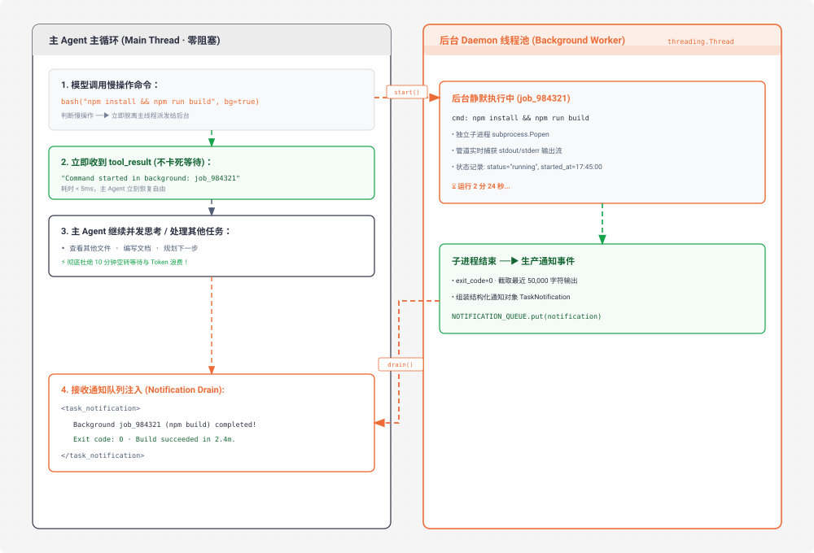

# s13 深度解析：Background Tasks 异步后台任务与通知注入

> **核心格言**：*“慢操作丢后台，Agent 继续处理”* —— 后台线程跑命令，完成后主动注入通知。  
> **架构定位**：Harness 层的**并发与非阻塞异步执行系统**，终结 Agent 面临编译、测试、安装等长时任务时的原地空转与算力浪费。 

---

## 🌟 动态全景流转图 (Animated Background Tasks Lifecycle)

<div align="center">
  
</div>

---

## 一、为什么必须有 s13？（设计动机）

你用过洗衣机吗？把衣服扔进去，按下启动，然后去做饭、看书。30 分钟后洗衣机“滴滴滴”提醒你洗好了。你绝不会站在洗衣机前面干等 30 分钟。

### 同步调用的痛点：
* `pip install torch` 需要 10 分钟；
* `cargo build --release` 需要 5 分钟；
* `npm test` 跑全量回归需要 3 分钟。
* **在同步模型下**：Agent 只能卡在 `execute_bash` 工具调用处，进程死等。大模型无法利用这段宝贵时间继续阅读其他代码或编写文档，不仅白白消耗会话生命周期，还可能因为网关超时导致连接中断。

**Harness 的异步解法**：为工具增加 `run_in_background: bool` 标识。慢操作直接扔到后台 Daemon 线程异步执行，主 Agent 立即拿到 `job_id` 返回值继续处理其他任务；后台完成后，通过**线程安全的状态锁与通知排空机制**在下一轮对话无缝将结果注入上下文！

---

## 二、同步阻塞 vs 异步后台对比

| 维度 | 同步执行 (s01 ~ s12) | 异步后台 (s13) |
| :--- | :--- | :--- |
| **慢操作处理** | 主进程死等 10 分钟 | 启动后台线程，立即返回 `job_id` |
| **主 Agent 状态** | 挂起阻塞，无法响应 | **零阻塞**，可并发思考、修改其他文件 |
| **结果交付方式** | 单次工具直接返回 | 完成后作为 `<task_notification>` 异步注入 |
| **触发模式** | 仅单条串行 | 模型显式请求 `run_in_background: true` / 启发式兜底 |

---

## 三、深度揭秘：通知如何从后台线程传递到主线程？

这是后台任务架构最核心的技术细节：**多线程并发安全**与**大模型消息协议约束**。

```
 ┌────────────────────────────────────────────────────────────────────────┐
 │ 后台工作线程 (Daemon Worker Thread)                                    │
 │                                                                        │
 │ 1. subprocess.run(command) 运行中 (耗时 2 分钟...)                     │
 │ 2. 执行完毕，获取线程互斥锁：                                          │
 │    with background_lock:                                               │
 │        background_tasks[bg_id]["status"] = "completed"                 │
 │        background_results[bg_id] = output                              │
 └───────────────────────────────────┬────────────────────────────────────┘
                                     │
                                     ▼ (共享内存 + background_lock 保护)
 ┌────────────────────────────────────────────────────────────────────────┐
 │ 主线程执行流 (Main Thread - agent_loop)                                │
 │                                                                        │
 │ 3. 主线程调用 collect_background_results() 检查已完工任务：              │
 │    with background_lock:                                               │
 │        ready = [bid for bid, t in background_tasks if t == "completed"]│
 │        output = background_results.pop(bid)                            │
 │                                                                        │
 │ 4. 组装 XML 格式通知：                                                 │
 │    <task_notification>                                                 │
 │      <task_id>bg_0001</task_id>                                        │
 │      <status>completed</status>                                        │
 │      <summary>Build succeeded in 2.4m</summary>                        │
 │    </task_notification>                                                │
 └────────────────────────────────────────────────────────────────────────┘
```

### 1. 线程安全保证 (`background_lock`)
* 在 Python 运行时中，主线程与后台工作线程共享全局内存。
* 当后台线程执行完耗时命令后，通过 `with background_lock:` 互斥锁，原子化地将任务状态更新为 `completed` 并存入 `background_results` 字典，避免了多线程并发读写的竞争态（Race Condition）。

---

## 四、深度揭秘：主线程如何将通知安全注入到上下文中？

将通知塞进 `messages[]` 绝不是简单地 `messages.append({"role": "user", ...})`，这里有一个极其关键的 **LLM API 协议防踩坑细节**：

### ⚠️ 协议陷阱：禁止连续的 User Message
在 Anthropic / OpenAI 等大模型的消息协议中，消息角色必须严格交替（`user` ➔ `assistant` ➔ `user` ➔ `assistant`）。  
如果主线程在刚刚回传了 `tool_result`（Role 为 `user`）之后，又单独追加一条 `{"role": "user", "content": "<task_notification>..."}`，就会产生 **连续两条 User 消息**，直接触发 API 400 报错！

### ✅ 正确解法：单轮混编聚合（Single Turn Multiplexing）
主线程将当前轮次的 **`tool_result` 列表** 与 **后台任务通知 `text` 块** 合并到**同一个 User Turn** 中一次性提交：

```python
# s13_background_tasks/code.py 核心精要

def agent_loop(messages: list, context: dict):
    while True:
        response = client.messages.create(...)
        messages.append({"role": "assistant", "content": response.content})

        if response.stop_reason != "tool_use":
            return

        # 1. 收集当前轮次工具的直接执行结果
        results = []
        for block in response.content:
            if block.type != "tool_use":
                continue

            if should_run_background(block.name, block.input):
                # 启动后台线程，立即返回任务已启动的确认信息
                bg_id = start_background_task(block)
                results.append({
                    "type": "tool_result",
                    "tool_use_id": block.id,
                    "content": f"[Background task {bg_id} started] Command: {block.input.get('command', '')}. Result will be available when complete."
                })
            else:
                output = execute_tool(block)
                results.append({"type": "tool_result", "tool_use_id": block.id, "content": output})

        # 2. 构造当前 User Message 容器
        user_content = list(results)

        # 3. 检查并提取已完成的后台通知
        bg_notifications = collect_background_results()
        if bg_notifications:
            for notif in bg_notifications:
                # 以纯文本块形式追加到同一个 user_content 中！
                user_content.append({"type": "text", "text": notif})
            print(f"  \033[32m[inject] {len(bg_notifications)} background notification(s)\033[0m")

        # 4. 一次性压入 messages，协议完全合规！
        messages.append({"role": "user", "content": user_content})
```

---

## 五、模型视角的完整上下文示例

在下一轮推理时，Claude 看到的上下文结构如下：

```json
[
  {
    "role": "assistant",
    "content": [
      {
        "type": "tool_use",
        "id": "toolu_01",
        "name": "bash",
        "input": {"command": "npm run build", "run_in_background": true}
      }
    ]
  },
  {
    "role": "user",
    "content": [
      {
        "type": "tool_result",
        "tool_use_id": "toolu_01",
        "content": "[Background task bg_0001 started] Command: npm run build. Result will be available when complete."
      },
      {
        "type": "text",
        "text": "<task_notification>\n  <task_id>bg_0001</task_id>\n  <status>completed</status>\n  <command>npm run build</command>\n  <summary>Build succeeded in 2.4m. Output bundle generated at dist/index.js</summary>\n</task_notification>"
      }
    ]
  }
]
```

通过这种设计，模型在同一轮中既看到了“命令已派发后台”的确认，又立刻获知了“后台任务已完成”的最终构建结果，逻辑严丝合缝！

---

## 六、Claude Code (CC) 源码深度映射

在真实的 Claude Code 生产源码中（`BashTool.tsx:241` / `BackgroundJobManager.ts`）：
* **交互式 Job 治理工具集**：CC 提供了 `job_list`, `job_output`, `job_kill` 等完整的后台作业治理指令集，允许模型在需要时主动轮询未完工任务的最新 stdout/stderr 增量。
* **流式通知排空**：CC 在前端 React / Ink 渲染层维护了一个事件订阅流，后台任务完成时会在终端右上角浮现动态提示，并在下一次 Query 提交时自动合并注入。

---

## 🎯 总结与启示

1. **通知传递的核心是“非阻塞检测 + 状态互斥锁”**：后台线程只负责在共享内存中更新状态，主线程在主循环关键检查点按需排空，绝不使用死锁式的同步等待。
2. **上下文注入的核心是“单轮多模态混编”**：将 `tool_result` 与 `<task_notification>` 文本合并到同一个 `user` message 中，严格保障 API 角色轮替契约的合规性。
