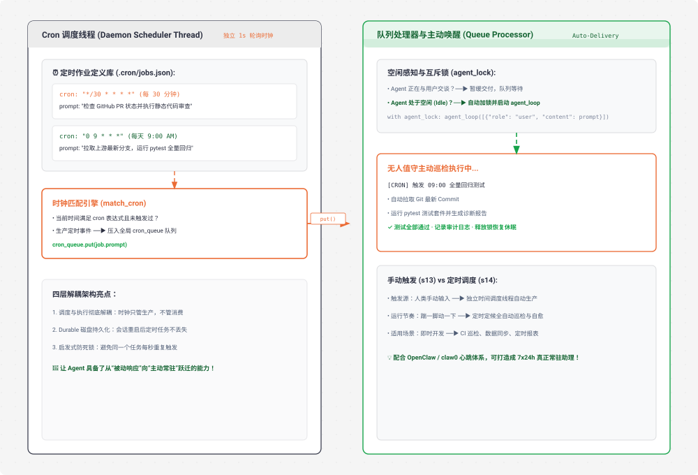

# s14 深度解析：Cron Scheduler 定时调度与解耦驱动架构

> **核心格言**：*“按时间表生产工作，调度与执行解耦”* —— 独立线程判断时间，队列传递触发。  
> **架构定位**：Harness 层的**时间驱动与常驻主动激活系统**，让 Agent 从“被动等待人类指令”进化为“主动按时巡检与自发干活”。

---

## 🌟 动态全景流转图 (Animated Cron Scheduler Pipeline)

<div align="center">
  
</div>

---

## 一、为什么必须有 s14？（设计动机）

闹钟不需要你盯着它才会响。你设好 7:00，到点它自己响，你在睡觉、在洗澡、在做饭，它都照响不误。

### 痛点根源：
* 在 `s01` ~ `s13` 中，Agent 的所有行为都是由人类在终端敲下回车**被动触发**的（“踹一下动一下”）。
* **业务需求**：现实中有大量周期性自动化工作：
  * *“每天早上 9 点拉取代码跑全量测试”*；
  * *“每 30 分钟检查一次 GitHub PR 并在有更新时执行 Code Review”*；
  * *“每天凌晨 2 点整理项目长期记忆并归档日志”*。
* 这些工作不应该需要人类每天定时人肉提醒 Agent。

**Harness 的解法**：构建四层解耦的 **Cron Scheduler 调度器**，将“何时触发（时间调度）”与“具体怎么做（Agent 执行）”彻底拆开。

---

## 二、端到端实战演练与终端执行全流程追踪 (Hands-on CLI Walkthrough)

### 1. 启动命令
打开终端并运行 S14 代码：
```bash
python s14_cron_scheduler/code.py
```

### 2. 模拟输入指令
在终端提示符注册一个周期性测试任务：
```text
s14 >> 设定一个定时任务：每 1 分钟检查一次当前目录下的 python 文件数量，并落盘持久化保存。
```

### 3. 终端实时执行日志全景追踪 (Log Trace)
```text
> schedule_cron
  [cron register] cron_008123 '* * * * *' → 检查当前目录下的 python 文件数量
  [cron] 持久化保存至 .scheduled_tasks.json

# ── 此时主 Agent 执行完毕进入休眠等待 ──
# ── 后台 Cron 独立守护线程每秒轮询时钟 (cron_scheduler_loop) ──
# ── 当时钟跨入下一分钟（如 18:01:00）时，时钟匹配引擎命中！──

  [cron fire] cron_008123 → 检查当前目录下的 python 文件数量
  [cron_queue] 压入待触发任务队列...

# ── Queue Processor 检测到 Agent 空闲，自动唤醒并加锁执行 ──
  [cron inject] 触发定时事件 ──► 自动启动 agent_loop

> glob (pattern="*.py")
  发现 5 个 python 文件: code.py, hello.py, test.py, auth.py, utils.py

当前目录下共有 5 个 Python 源代码文件，系统运行正常。
```

### 4. 打开第二个终端观察磁盘定时任务文件 (Disk Inspection)
```bash
# 查看持久化的 Cron 任务清单
cat .scheduled_tasks.json
# 输出示例：
# [
#   {
#     "id": "cron_008123",
#     "cron": "* * * * *",
#     "prompt": "检查当前目录下的 python 文件数量",
#     "recurring": true,
#     "durable": true
#   }
# ]
```

---

## 三、Cron 调度系统的四层分层模型

```
 ┌────────────────────────────────────────────────────────┐
 │ 1. Scheduler (调度线程 · 独立 Daemon 线程每秒巡检时钟) │
 └────────────────────────────┬───────────────────────────┘
                              │ (时间匹配成功，生产事件)
                              ▼
 ┌────────────────────────────────────────────────────────┐
 │ 2. Queue (cron_queue 线程安全事件缓冲队列)            │
 └────────────────────────────┬───────────────────────────┘
                              │
                              ▼
 ┌────────────────────────────────────────────────────────┐
 │ 3. Queue Processor (队列处理器 · 监听 Agent 空闲状态) │
 └────────────────────────────┬───────────────────────────┘
                              │ (Agent 空闲，无缝加锁交付)
                              ▼
 ┌────────────────────────────────────────────────────────┐
 │ 4. Consumer / Agent Loop (执行端 · 唤醒模型执行任务)  │
 └────────────────────────────────────────────────────────┘
```

---

## 四、关键源码逐行深度拆解与 Python 语法糖详解

### 1. Cron 表达式解析与 `zip()` 多元并行迭代
```python
def match_cron(cron_expr: str, dt: datetime) -> bool:
    """解析五段式 cron 表达式并与当前系统时钟比对"""
    parts = cron_expr.split()
    fields = [dt.minute, dt.hour, dt.day, dt.month, dt.weekday()]
    
    # 🔍 语法糖 1：zip(iterA, iterB) 并行迭代
    # zip() 将 parts（['*/5', '*', '*', '*', '*']）和 fields（[15, 10, 24, 2, 0]）
    # 成对打包成元组 ('*/5', 15), ('*', 10)...，避免使用索引下标访问数组越界。
    for pattern, val in zip(parts, fields):
        if pattern == "*":
            continue
        if pattern.startswith("*/"):
            # 🔍 语法糖 2：字符串切片 `pattern[2:]` 取出步长数字
            step = int(pattern[2:])
            if val % step != 0: 
                return False
        elif int(pattern) != val:
            return False
    return True
```

---

### 2. 线程互斥锁与 `with` 上下文管理器 (`threading.Lock`)
```python
agent_lock = threading.Lock()

def queue_processor():
    """队列处理器：在 Agent 处于闲置状态时自动提取任务并执行"""
    while True:
        job = CRON_QUEUE.get()  # 阻塞等待队列事件
        
        # 🔍 语法糖 3：with lock 上下文管理器 (Context Manager)
        # `with agent_lock:` 会在进入代码块前自动调用 agent_lock.acquire() 加锁，
        # 在离开代码块时（无论是正常返回还是抛出异常），自动保证调用 agent_lock.release() 释放锁！
        # 彻底避免了因异常导致锁无法释放产生的死锁（Deadlock）灾难！
        with agent_lock:
            print(f"\033[32m[PROCESSOR] 成功获取锁，自动交付定时任务给 Agent 执行...\033[0m")
            agent_loop([{"role": "user", "content": job.prompt}])
```

---

### 3. 日期感知时间戳标记防重复触发
```python
_last_fired: dict[str, str] = {}

def scheduler_loop(jobs: list[CronJob]):
    while True:
        time.sleep(1)
        now = datetime.now()
        
        # 🔍 语法糖 4：strftime 格式化时间字符串
        # 生成 "2025-02-24 18:01" 这种分钟级唯一标记，
        # 同一分钟内的 60 次轮询只会触发 1 次，第二天同一时间又会自动重新触发！
        minute_marker = now.strftime("%Y-%m-%d %H:%M")
        
        for job in jobs:
            if match_cron(job.cron, now):
                # 🔍 语法糖 5：dict.get(key) 安全获取，不存在时返回 None
                if _last_fired.get(job.id) != minute_marker:
                    CRON_QUEUE.put(job)
                    _last_fired[job.id] = minute_marker
                    print(f"  \033[35m[cron fire] {job.id} → {job.prompt[:40]}\033[0m")
```

---

## 五、Claude Code (CC) 源码映射

在真实的 Claude Code 生产源码中（`useQueueProcessor.ts` / `cronManager.ts`）：
* **UI 状态智能规避**：当检测到用户正在输入框键入文字或终端正在高频交互时，Queue Processor 会智能抑制定时任务的插入，直到检测到终端静默 5 秒后才悄悄激活执行。
* **持久化 Cron 守护**：支持将定时巡检任务持久化在 `.claude/cron.json`，即使 IDE 关闭后重开，调度器也会自动补齐落下的周期性任务。

---

## 🎯 总结与启示

* **这是 Agent 从“工具”走向“虚拟员工”的关键跃迁**。
* 结合持久化任务系统与定时调度器，Agent 可以在夜深人静时自动跑回归、整理文档、巡检依赖漏洞，成为真正不知疲倦的 7x24h 智能伙伴。
