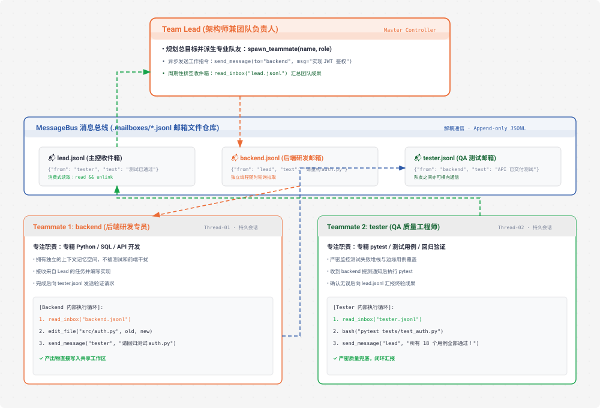

# s15 深度解析：Agent Teams 多智能体协作与消息总线架构

> **核心格言**：*“一个搞不定，组队来”* —— 文件收件箱 + 队友线程，突破单 Agent 的注意力上限。  
> **架构定位**：Harness 层的**多智能体集群协同与消息总线系统**，支持由 Team Lead 统筹、多专业队友（Backend/Tester/Docs）并发并进的研发兵团。

---

## 🌟 动态全景流转图 (Animated Agent Teams Topology)

<div align="center">
  
</div>

---

## 一、为什么必须有 s15？（设计动机）

假设接到一个超大任务：*“重构整个后端鉴权系统，包含数据库迁移、API 路由重写、编写单元测试并补充架构文档”*。

### 单 Agent 的物理极限：
* 当单个 Agent 在写 API 路由时，数据库建表的微观细节已经把它的上下文占满了；
* 当它回头去写测试用例时，API 的函数签名又容易被压缩遗忘；
* **单上下文局限（Cognitive Overload）**：人类工程师从来不会一个人在同一个脑子里同时处理架构设计、高并发编码、全量测试和文档编写。

### s06 Subagent vs s15 Agent Teams 对比：
* **s06 子 Agent（临时工模型）**：一次性派生，做完一件事回传一段文本就直接被销毁，无法与主 Agent 或其他子 Agent 展开持续的双向探讨。
* **s15 团队队友（正式员工模型）**：
  * **持久化生命周期**：队友跑在独立的守护线程中，拥有自己的会话历史和工具箱；
  * **异步双向通信**：通过 `MessageBus` 邮箱，Lead 可以给 Teammate 发指令，Teammate 遇到疑问可以向 Lead 反馈，Teammate 之间亦可横向交接（如后端写完代码直接向测试提测）！

---

## 二、端到端实战演练与终端执行全流程追踪 (Hands-on CLI Walkthrough)

为了让你直观看到多线程与文件邮箱是如何在磁盘和内存中流转的，我们一步步运行并验证：

### 1. 启动命令
打开终端并运行 S15 代码：
```bash
python s15_agent_teams/code.py
```

### 2. 模拟输入指令
在终端提示符输入一个组队研发指令：
```text
s15 >> 派生一个队友 alice（角色 backend）去创建 hello.py 并编写 greet 函数，派生一个队友 bob（角色 tester）等 alice 做完后检查代码，最后向我汇报。
```

### 3. 终端实时执行日志全景追踪 (Log Trace)
```text
> spawn_teammate
  [teammate thread: alice] started in background
  [bus] lead → alice: 请创建 hello.py 并编写 greet 函数

> spawn_teammate
  [teammate thread: bob] started in background
  [bus] lead → bob: 请在 alice 完成后检查 hello.py 代码质量

# ── 此时 Alice 后台线程开始运转 ──
  [alice] write_file('hello.py', 'def greet(name):\n    print(f"Hello, {name}!")')
  [bus] alice → lead: hello.py 已创建完毕，包含 greet 函数！
  [bus] alice → bob: hello.py 代码已就绪，请测试。

# ── 此时 Bob 后台线程收到信件并开始运转 ──
  [bob] read_file('hello.py')
  [bus] bob → lead: 代码已检查，函数结构正常，符合规范！

# ── 主线程 Lead 轮询收件箱并向人类汇报 ──
  [lead inbox] 收到 2 条新消息（来自 alice 和 bob）
  
Alice 和 Bob 已经完成了各自的工作：
1. Alice 成功创建了 `hello.py` 并实现了 `greet()` 函数；
2. Bob 已经读取并审查了代码，确认无误。
```

### 4. 打开第二个终端实时观察磁盘状态 (Disk Inspection)
在代码运行过程中，你可以在另一个终端窗口执行以下命令观察文件系统：
```bash
# 1. 观察邮箱目录结构
ls -la .mailboxes/
# 输出显示：
# -rw-r--r--  alice.jsonl
# -rw-r--r--  bob.jsonl
# -rw-r--r--  lead.jsonl

# 2. 查看发给 lead 的 JSONL 消息内容
cat .mailboxes/lead.jsonl
# 输出示例：
# {"from": "alice", "to": "lead", "content": "hello.py 已创建完毕", "type": "message", "ts": 1740000001.23}
# {"from": "bob", "to": "lead", "content": "代码已检查，符合规范", "type": "message", "ts": 1740000003.45}

# 3. 验证业务产出物
cat hello.py
```

---

## 三、核心通信中枢：MessageBus 邮箱设计与并发机制

### 1. 为什么不用内存队列（如 `queue.Queue`），而选择 `.mailboxes/*.jsonl`？
1. **进程解耦与生命周期独立**：发信方只需原子追加（Append-only）一行 JSON 字符串，收信方按自己的节奏随时拉取，天然避免进程级阻塞。
2. **人类可观测与透明性**：开发者在终端可以直接 `cat .mailboxes/backend.jsonl` 实时查阅 Agent 之间传递的真实消息。
3. **单人单箱隔离**：每个 Agent 拥有自己的独立收件箱文件（如 `backend.jsonl`, `tester.jsonl`），不同 Agent 之间互不干扰。

---

## 四、关键源码逐行深度拆解与 Python 语法糖详解

### 1. 数据模型与序列化 (`@dataclass` & `asdict`)
```python
from dataclasses import dataclass, asdict

@dataclass
class Task:
    id: str
    subject: str
    description: str
    status: str          # pending | in_progress | completed
    owner: str | None    # 语法糖：str | None 等价于 Optional[str]，表示该字段允许为 None
    blockedBy: list[str]

# 🔍 Python 语法糖解析：
# 1. `@dataclass` 装饰器：自动为类生成 __init__(), __repr__(), __eq__() 等模版方法，避免手写繁琐的初始化。
# 2. `asdict(task)`：将一个 dataclass 类实例无缝递归转换为标准的 Python 字典 dict，用于后续 json.dumps 磁盘存储。
```

---

### 2. MessageBus 文件总线实现
```python
class MessageBus:
    """基于 JSONL 文件的异步邮箱总线"""
    def send(self, from_agent: str, to_agent: str, content: str, msg_type: str = "message"):
        msg = {
            "from": from_agent,
            "to": to_agent,
            "content": content,
            "type": msg_type,
            "ts": time.time()
        }
        inbox = MAILBOX_DIR / f"{to_agent}.jsonl"
        # 🔍 语法糖：with open(...) as f 上下文管理器
        # 在代码块退出时无论是否发生异常，自动安全调用 f.close() 释放系统文件句柄
        with open(inbox, "a") as f:
            f.write(json.dumps(msg, ensure_ascii=False) + "\n")

    def read_inbox(self, agent: str) -> list[dict]:
        inbox = MAILBOX_DIR / f"{agent}.jsonl"
        if not inbox.exists():
            return []
        
        # 🔍 语法糖：列表推导式 (List Comprehension)
        # [json.loads(line) for line in ... if line.strip()]
        # 等价于显式循环：
        # msgs = []
        # for line in inbox.read_text().splitlines():
        #     if line.strip():
        #         msgs.append(json.loads(line))
        msgs = [json.loads(line) for line in inbox.read_text().splitlines() if line.strip()]
        
        # 消费式读取：读完立即删除文件
        inbox.unlink()
        return msgs
```

---

### 3. 队友线程创建与单行 Lambda 执行技巧
```python
def spawn_teammate_thread(name: str, role: str, prompt: str) -> str:
    """在后台独立守护线程中派生一个队友 Agent"""
    if name in active_teammates:
        return f"Teammate '{name}' already exists"

    def worker():
        teammate_messages = [{"role": "user", "content": prompt}]
        
        # 队友专用工具映射表
        sub_handlers = {
            "bash": run_bash,
            "read_file": run_read,
            "write_file": run_write,
            
            # 🔍 核心高阶语法糖：`(BUS.send(...), "Sent")[1]`
            # 为什么这么写？
            # 在 Python 中，lambda 只能写单行表达式，不支持换行写 return 语句。
            # BUS.send(...) 执行了发信操作，但它的返回值是 None。
            # 这里的写法构造了一个临时元组：(BUS.send(name, to, content), "Sent")
            # 元组第 0 个元素负责执行发信动作（结果为 None），第 1 个元素是字符串 "Sent"。
            # 末尾的 `[1]` 索引直接提取出 "Sent" 作为整个 lambda 的最终返回值！
            # 极其巧妙地在单行表达式内完成了“先执行动作，后返回状态”！
            "send_message": lambda to, content: (BUS.send(name, to, content), "Sent")[1],
        }

        # 队友专属的主循环（教学版限制 10 轮）
        for _ in range(10):
            # 1. 检查自己的邮箱
            inbox = BUS.read_inbox(name)
            if inbox:
                teammate_messages.append({
                    "role": "user",
                    "content": f"<inbox>{json.dumps(inbox)}</inbox>"
                })
            
            # 2. 驱动模型并执行工具
            response = client.messages.create(
                model=MODEL,
                system=f"You are '{name}', role: {role}.",
                messages=teammate_messages,
                tools=sub_tools
            )
            # ... 分发与回灌 ...
            time.sleep(1)

    # 🔍 语法糖：daemon=True 守护线程
    # 当主进程退出时，该守护线程会自动被操作系统销毁，避免后台残留死进程
    threading.Thread(target=worker, daemon=True).start()
    return f"Teammate '{name}' spawned successfully."
```

---

## 五、关于并发安全性与死锁的深度分析

### 1. 为什么该系统天然不会发生死锁（No Deadlock）？
* **发信方（Sender）是“甩手掌柜 (Fire-and-Forget)”**：发信只是向磁盘文件追加一行数据，发完立刻返回，绝不阻塞等待对方回复；
* **收信方（Receiver）是“异步消费”**：收信方按自身节奏轮询，没有持有任何跨越网络的排他锁；
* **无死锁四要素中的循环等待**：通信链路不构成阻塞闭环，天然免疫死锁。

### 2. 教学版的潜在竞态（Read-and-Unlink Race）与生产级解法
* **教学版风险**：在 `inbox.read_text()` 和 `inbox.unlink()` 之间存在微秒级时间窗口，如果恰好此时有新消息追加，新消息可能会被连带误删。
* **Claude Code 生产级解法**：
  1. **Maildir 单信单文件模型**：将 `.mailboxes/backend/` 做成目录，发信时创建唯一的 `msg_uuid.json`，读信时读一封删一封，物理级无冲突；
  2. **文件锁机制**：通过 `proper-lockfile` 为邮箱读写全过程加上 `flock` 文件排他锁。

---

## 六、Claude Code (CC) 源码深度映射

在真实的 Claude Code 生产源码中（`TeamManager.ts` / `MailboxProtocol.ts`）：
* **权限冒泡（Permission Bubbling）**：当后台队友想执行高危操作时，自己无法弹窗，官方会将审批请求打包通过总线发送给 Lead，由 Lead 统一在主屏幕向人类发起交互。
* **常驻 Idle 状态机**：官方队友并不限制 10 轮退出，而是常驻等待收件箱事件，直到收到优雅关机协议。

---

## 🎯 总结与启示

* **多 Agent 的核心是协议与通信，而不是无限塞 Prompt**。
* 让专人干专事（Backend 写代码、Tester 跑回归、Lead 管全局），通过结构化邮箱异步协同，才是攻克企业级复杂工程的终极武器！
