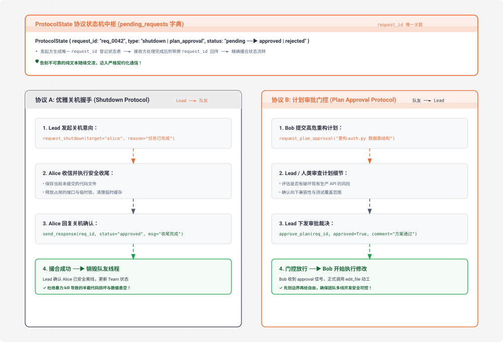

# s16 深度解析：Team Protocols 结构化握手与团队协商协议

> **核心格言**：*“队友之间要有约定”* —— 基于 Request-Response 模式驱动结构化协商。  
> **架构定位**：Harness 层的**团队治理与强契约交互协议**，规范 Agent 之间的优雅关机、高危操作前置审批与权限收敛。

---

## 🌟 动态全景流转图 (Animated Team Protocols Workflow)

<div align="center">
  
</div>

---

## 一、为什么必须有 s16？（设计动机）

在 `s15` 中，虽然建立了 `MessageBus` 邮箱，但通信本质上还是“自由散漫的非结构化文本”。在两个关键业务场景下，无协议通信会带来巨大灾难：

### 场景 1：粗暴关机导致数据损坏
* Lead 认为任务完成了，直接调用 `thread.kill()` 或停止调度；
* 此时队友 Alice 可能正写完一个 500 行的重构文件，`write_file` 刚刷入一半内容；
* **后果**：磁盘留下语法残缺的半截代码，导致整个项目代码库构建彻底崩溃。

### 场景 2：高危重构脱缰失控
* 队友 Bob 擅自决定把数据库主键从 `int` 改成 `uuid`，或者把整个公共 API 路由推倒重写；
* **后果**：直接把其他队友的并行开发分支全部废掉。

**Harness 的解法**：建立 **Request-Response 结构化协议**。所有高危动作和生命周期变动，必须通过唯一的 `request_id` 建立状态追踪机（`pending` → `approved` / `rejected`），执行严格的握手与审批放行。

---

## 二、端到端实战演练与终端执行全流程追踪 (Hands-on CLI Walkthrough)

### 1. 启动命令
打开终端并运行 S16 代码：
```bash
python s16_team_protocols/code.py
```

### 2. 模拟输入指令
在终端提示符输入协议审批与关机组合指令：
```text
s16 >> 派生队友 alice（角色 backend）去编写 fib.py。要求她必须先 submit_plan 提交重构方案给我审批，审批通过后才能写代码；任务做完后向她发起优雅关机握手，最后向我汇报。
```

### 3. 终端实时执行日志全景追踪 (Log Trace)
```text
> spawn_teammate
  [teammate thread: alice] started
  [bus] lead → alice: 请编写 fib.py，先提交 plan 方案给我审批

# ── 1. Alice 线程发起计划审批请求 ──
  [alice] submit_plan("计划创建 fib.py，包含递归与动态规划两种实现及单元测试")
  [bus] alice → lead: plan_approval_request (req_0001)

# ── 2. 主线程 Lead 接收请求并审核 ──
> check_inbox
  [lead] 收到来自 alice 的审批申请: [plan_approval_request req:req_0001]
> review_plan
  [protocol] plan ✓ (req_0001)
  [bus] lead → alice: plan_approval_response (approved)

# ── 3. Alice 收到批准信号，正式动工写文件 ──
  [alice] write_file('fib.py', 'def fib(n): ...')
  [alice] send_message('lead', '代码已写完并自测通过！进入 idle 等待。')

# ── 4. Lead 发起优雅关机握手 ──
> request_shutdown
  [protocol] shutdown_request → alice (req_0002)
  [bus] lead → alice: shutdown_request (req_0002)

# ── 5. Alice 在 Idle 轮询中收到关机请求，执行收尾并确认 ──
  [alice] 执行现场保存与临时锁清理...
  [bus] alice → lead: shutdown_response (approved, req_0002)
  [alice] 线程安全退出完毕。

# ── 6. Lead 确认撮合成功并向人类汇报 ──
  [protocol] 协议撮合成功: req_0002 (shutdown) -> approved
  
Alice 已成功完成全流程：
1. 提交了方案并通过了审批；
2. 编写了 `fib.py`；
3. 响应了优雅关机协议，已安全离线！
```

### 4. 打开第二个终端验证消息协议结构 (Disk Inspection)
```bash
# 1. 观察邮箱中的结构化协议 JSON（在未被 consume 前）
cat .mailboxes/lead.jsonl
# 输出示例：
# {
#   "from": "alice",
#   "to": "lead",
#   "content": "计划创建 fib.py",
#   "type": "plan_approval_request",
#   "metadata": {"request_id": "req_0001"},
#   "ts": 1740000010.12
# }

# 2. 检查生成的业务文件
cat fib.py
```

---

## 三、两大核心团队协议设计

### 1. 优雅关机协议 (Shutdown Protocol)
* **方向**：`Team Lead` ──► `Teammate`
* **四步握手流程**：
  1. **Lead 发起关机意向**：生成 `request_id`（如 `req_0042`），将状态置为 `pending`，发送 `shutdown_request`；
  2. **Teammate 收到请求并收尾**：保存手头所有未提交的文件、跑完最后一轮轻量检查、清理临时锁与缓存；
  3. **Teammate 回传确认**：发送 `shutdown_response(req_id, status="approved")`；
  4. **Lead 确认撮合**：Lead 确认队友已经体面收尾，正式销毁工作线程并更新团队状态。

### 2. 计划审批协议 (Plan Approval Protocol)
* **方向**：`Teammate` ──► `Team Lead` / 人类
* **执行门控逻辑**：
  1. 队友在动手修改核心敏感文件前，必须先写一份 Plan 并提交 `plan_approval_request`；
  2. Lead 或人类审查计划可行性，签署下发 `approve_plan(req_id, approved=True)`；
  3. 队友仅在收到 `approved` 确认信号后，对应的 `edit_file` / `write_file` 门控才会被放行执行。

---

## 四、关键源码逐行深度拆解与 Python 语法糖详解

### 1. ProtocolState 状态记录结构体
```python
from dataclasses import dataclass

@dataclass
class ProtocolState:
    request_id: str      # 唯一请求 ID，如 "req_004281"
    type: str            # "shutdown" | "plan_approval"
    sender: str          # 发起方 Agent 名字
    target: str          # 接收方 Agent 名字
    status: str          # "pending" | "approved" | "rejected"
    payload: str         # 附带内容（计划方案或关机原因）
    created_at: float    # 发起时间戳

# 全局内存中的待处理协议请求字典
pending_requests: dict[str, ProtocolState] = {}
```

---

### 2. 审批审查与三元表达式
```python
def run_review_plan(request_id: str, approve: bool, feedback: str = "") -> str:
    """Lead 审核队友提交的计划方案"""
    
    # 🔍 语法糖 1：dict.get(key) 安全查询
    # 使用 pending_requests.get(...) 如果 request_id 不存在会返回 None，避免直接用 [] 报 KeyError 崩溃
    state = pending_requests.get(request_id)
    if not state:
        return f"Request {request_id} not found"
    if state.status != "pending":
        return f"Request {request_id} already {state.status}"

    # 🔍 语法糖 2：三元条件表达式 (Ternary Operator)
    # result = value_true if condition else value_false
    state.status = "approved" if approve else "rejected"

    # 🔍 语法糖 3：短路求值 (Short-circuit Evaluation)
    # `feedback or ("Approved" if approve else "Rejected")`
    # 若 feedback 提供了非空字符串则使用 feedback；若为空则回退计算后半段
    reply_content = feedback or ("Approved" if approve else "Rejected")

    BUS.send(
        from_agent="lead",
        to_agent=state.sender,
        content=reply_content,
        msg_type="plan_approval_response",
        metadata={"request_id": request_id, "approve": approve}
    )
    
    # 🔍 语法糖 4：嵌套格式化输出
    icon = "✓" if approve else "✗"
    print(f"  \033[32m[protocol] plan {icon} ({request_id})\033[0m")
    return f"Plan {'approved' if approve else 'rejected'} ({request_id})"
```

---

### 3. 协议消息分发与后缀匹配
```python
def consume_lead_inbox(route_protocol: bool = True) -> list[dict]:
    """读取 Lead 的收件箱，自动路由协议应答"""
    msgs = BUS.read_inbox("lead")
    if route_protocol:
        for msg in msgs:
            meta = msg.get("metadata", {})
            req_id = meta.get("request_id", "")
            msg_type = msg.get("type", "")
            
            # 🔍 语法糖 5：str.endswith() 语义匹配
            # 只要消息类型以 "_response" 结尾（如 shutdown_response、plan_approval_response）
            # 均视为契约响应，自动提取撮合状态机
            if req_id and msg_type.endswith("_response"):
                match_response(msg_type, req_id, meta.get("approve", False))
    return msgs
```

---

## 五、Claude Code (CC) 源码深度映射

在真实的 Claude Code 生产源码中（`ProtocolHandler.ts` / `ApprovalGate.ts`）：
* **代码级工具硬门控（Code-Level Tool Gating）**：教学版依赖大模型自身“收到 approval 前不要动代码”的指令遵循；而官方 CC 生产中，在未收到 `plan_approval_response` 之前，队友的 `write_file` 和 `bash` 会在 Harness 层直接被拦截并返回 `<gated_error>`，做到物理级强制阻断。
* **Strict Message Matcher 严格校验器**：CC 在收到回复时，不仅校验 `req_id`，还会强校验响应类型是否匹配请求类型，防止协议串扰。
* **超时自动熔断（Timeout Fallback）**：如果关机请求发出后队友在 30 秒内无响应，协议状态机将自动标记为 `timeout_force_killed`，并发出警告日志。

---

## 🎯 总结与启示

* **自由度越高，契约必须越严密**。
* 结构化协议让一群各自思考、并发并进的独立 Agent 能够像一支训练有素的军队一样严谨协同，彻底告别数据竞态与失控风险！
