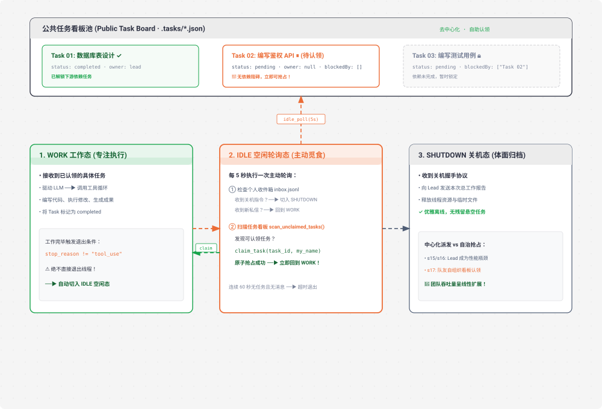

# s17 深度解析：Autonomous Agents 自治认领与自组织协同架构

> **核心格言**：*“自己看板，自己认领”* —— 空闲时主动轮询，有活就干。  
> **架构定位**：Harness 层的**去中心化多智能体自组织引擎**，摆脱对中心化 Lead 逐个分派任务的单点瓶颈。

---

## 🌟 动态全景流转图 (Animated Autonomous Agents Lifecycle)

<div align="center">
  
</div>

---

## 一、为什么必须有 s17？（设计动机）

在 `s15` 和 `s16` 中，虽然队友拥有独立线程与通信协议，但协作模式本质上仍是**“高度中心化的主管派活制”**：
* 任务看板上有 20 个待办任务，Lead 必须逐一调用 `send_message(to="alice", task="...")` 派发 20 次；
* 队友做完手头的活后，只能原地傻等 Lead 的下一道指令。如果 Lead 正在思考大局或处理复杂逻辑，所有的队友线程全处于闲置挂起状态！

**瓶颈核心**：Team Lead 成为了整个集群的吞吐量瓶颈（Single Point of Bottleneck）。
**s17 的解法**：**去中心化任务认领（Decentralized Self-Organization）**。队友拥有三阶段状态机，做完任务自动进入 `IDLE` 闲置轮询态，每 5 秒主动扫描公共任务看板，发现可执行任务立即原子抢占（`task_claim`）动工，形成自发自愈的超级研发蜂群！

---

## 二、端到端实战演练与终端执行全流程追踪 (Hands-on CLI Walkthrough)

### 1. 启动命令
打开终端并运行 S17 代码：
```bash
python s17_autonomous_agents/code.py
```

### 2. 模拟输入指令
在终端提示符输入一个长链路自治研发任务：
```text
s17 >> 创建 3 个带依赖的任务：1. 创建 models.py 数据模型 2. 编写 crud.py 依赖 models 3. 编写 test_crud.py 依赖 crud。派生 alice 和 bob 两个自治队友，让他们自己看看板抢任务干活，全部做完后向我汇总汇报。
```

### 3. 终端实时执行日志全景追踪 (Log Trace)
```text
> create_task
  [create] 创建 models.py 数据模型 (id: task_01)
> create_task
  [create] 编写 crud.py 接口 (id: task_02, blockedBy: task_01)
> create_task
  [create] 编写 test_crud.py (id: task_03, blockedBy: task_02)

> spawn_teammate (alice, backend)
  [teammate thread: alice] started -> 进入 IDLE 轮询
> spawn_teammate (bob, fullstack)
  [teammate thread: bob] started -> 进入 IDLE 轮询

# ── 1. Alice 扫描看板并原子抢占 Task 1 ──
  [IDLE] alice 扫描公共任务看板...
  [auto-claim] alice 抢占 task_01: 创建 models.py 数据模型
  [alice WORK] 编写 models.py -> 执行完毕
  [complete] task_01 ✓ ──► 解锁下游 task_02！
  [IDLE] alice 任务完毕，重新进入 IDLE 轮询

# ── 2. Bob 在下一轮轮询中发现 Task 2 已解锁，立即抢占 ──
  [IDLE] bob 扫描公共任务看板...
  [auto-claim] bob 抢占 task_02: 编写 crud.py 接口
  [bob WORK] 编写 crud.py -> 执行完毕
  [complete] task_02 ✓ ──► 解锁下游 task_03！
  [IDLE] bob 重新进入 IDLE 轮询

# ── 3. Alice 抢占已解锁的 Task 3 并完成测试 ──
  [auto-claim] alice 抢占 task_03: 编写 test_crud.py
  [alice WORK] 运行 pytest test_crud.py -> 全部通过！
  [complete] task_03 ✓
  
# ── 4. 所有任务全绿，Lead 收到队友汇报并汇总 ──
  [lead inbox] 收到 alice 和 bob 的终验成果
  
🎉 所有 3 个链式依赖任务均已被 Alice 和 Bob 自主认领并协同完成：
1. models.py (Alice 完成)
2. crud.py (Bob 完成)
3. test_crud.py (Alice 完成，全部测试通过)
```

### 4. 打开第二个终端实时观察任务状态变迁 (Disk Inspection)
```bash
# 实时观察 .tasks/ 目录下各 JSON 文件的 status 和 owner 变化
watch -n 1 "head -n 20 .tasks/*.json | grep -E '(id|subject|status|owner)'"
# 输出演变过程：
# task_01: status: "in_progress", owner: "alice" ➔ "completed"
# task_02: status: "pending" ➔ "in_progress", owner: "bob" ➔ "completed"
# task_03: status: "pending" ➔ "in_progress", owner: "alice" ➔ "completed"
```

---

## 三、三阶段自治状态机 (The Three-State Machine)

| 阶段 (State) | 核心行为 | 进入与流转触发条件 |
| :--- | :--- | :--- |
| **`WORK` (工作态)** | 专注执行当前已认领任务，驱动 LLM 与工具循环 | 收到新任务或从看板原子抢占成功 |
| **`IDLE` (空闲轮询态)** | 每 5s 轮询自身邮箱与公共任务看板；发现活立刻抢 | 工具循环结束 (`stop_reason != "tool_use"`) |
| **`SHUTDOWN` (优雅关机态)** | 发送工作归档总结，释放线程资源与临时文件 | 收到关机握手协议 或 连续 60s 闲置超时 |

---

## 四、关键源码逐行深度拆解与 Python 语法糖详解

### 1. 空闲轮询与任务原子抢占
```python
IDLE_POLL_INTERVAL = 5   # 空闲轮询周期：5 秒
IDLE_TIMEOUT = 60         # 闲置超时时间：60 秒

def idle_poll(name: str, messages: list, role: str) -> str:
    """
    🔍 语法糖 1：整除运算符 `//`
    IDLE_TIMEOUT // IDLE_POLL_INTERVAL 计算结果为 12。
    使用整除保证生成严格的整数迭代步数，避免浮点数在 range() 中的类型错误。
    """
    for _ in range(IDLE_TIMEOUT // IDLE_POLL_INTERVAL):
        time.sleep(IDLE_POLL_INTERVAL)

        # ① 优先级 1：先检查个人邮箱（优先响应人类和 Lead 指令）
        inbox = BUS.read_inbox(name)
        if inbox:
            for msg in inbox:
                if msg.get("type") == "shutdown_request":
                    handle_shutdown(msg)
                    return "shutdown"
            
            # 🔍 语法糖 2：列表推导式条件提取
            non_protocol = [m for m in inbox if m.get("type") == "message"]
            if non_protocol:
                messages.append({
                    "role": "user", 
                    "content": f"<inbox>{json.dumps(non_protocol)}</inbox>"
                })
                return "work"

        # ② 优先级 2：扫描公共任务看板，自主抢占无依赖任务
        unclaimed = scan_unclaimed_tasks()
        if unclaimed:
            for task in unclaimed:
                if is_task_unlocked(task):
                    result = claim_task(task["id"], owner=name)
                    
                    # 🔍 语法糖 3：in 关键字子字符串匹配
                    if "Claimed" in result:
                        print(f"  \033[32m[auto-claim] {name} 抢占任务: {task['subject']}\033[0m")
                        messages.append({
                            "role": "user", 
                            "content": f"<claimed_task>You claimed {task['id']}: {task['subject']}. Begin execution.</claimed_task>"
                        })
                        return "work"

    return "timeout"  # 连续 60 秒既没信件也没新任务，进入超时退出
```

---

### 2. 逆序迭代器与最后摘要提取
```python
def extract_last_summary(messages: list) -> str:
    """
    🔍 语法糖 4：reversed() 反向迭代器
    reversed(messages) 并不创建列表的新拷贝，而是直接从尾到头高效遍历。
    我们在会话结束时，快速从最后一条 assistant 消息中提取出任务的最终总结文本。
    """
    for msg in reversed(messages):
        if msg.get("role") == "assistant":
            content = msg.get("content", "")
            if isinstance(content, str):
                return content
            elif isinstance(content, list):
                # 遍历提取 text 类型的 block
                texts = [b.get("text", "") for b in content if isinstance(b, dict) and b.get("type") == "text"]
                if texts:
                    return "\n".join(texts)
    return "Task completed."
```

---

## 五、Claude Code (CC) 源码深度映射

在真实的 Claude Code 生产源码中（`AutonomousWorker.ts` / `TaskScheduler.ts`）：
* **原子文件锁抢占（Atomic Claim Lock）**：在真实高并发下，多个队友可能在同一毫秒扫描到同一个任务。CC 通过原子文件重命名或 `flock` 保证同一任务绝对只能被 1 个 Agent 抢占成功，未抢到的自动顺延下一个。
* **技能匹配度自检（Role Affinity Scoring）**：队友在认领前，会检查任务标签（`tags: ["database", "python"]`）与自身 Role 的契合度，优先认领自身擅长领域的任务。

---

## 🎯 总结与启示

* **自组织是多智能体规模化（Scaling）的唯一解**。
* 从“主管喂饭吃”到“员工自己看板找活干”，系统的协作吞吐量彻底打破了中心化单点限制，实现了集群算力利用率的最大化！
