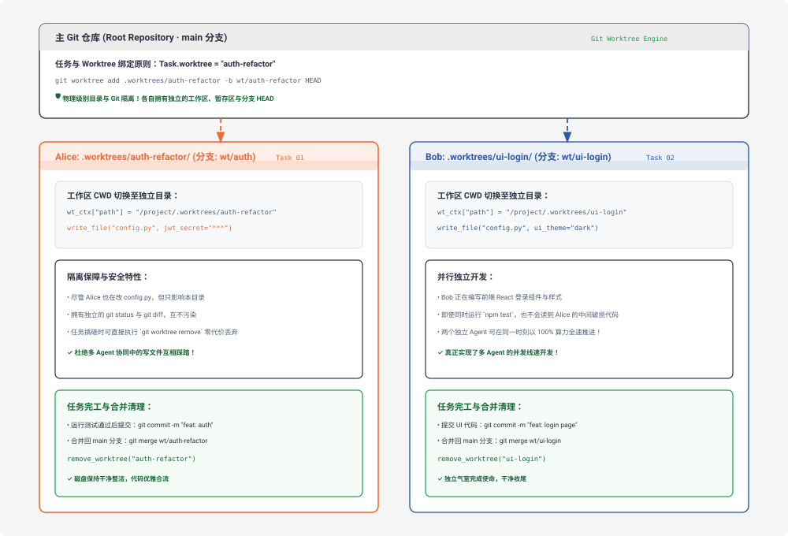

# s18 深度解析：Worktree Isolation 目录沙箱与并行文件隔离架构

> **核心格言**：*“各干各的目录，互不干扰”* —— 任务管目标，Worktree 管目录，按 ID 强绑定。  
> **架构定位**：Harness 层的**物理文件系统与 Git 分支级沙箱隔离引擎**，彻底解决多 Agent 并发开发时的代码冲突与互相踩踏。

---

## 🌟 动态全景流转图 (Animated Worktree Isolation Topology)

<div align="center">
  
</div>

---

## 一、为什么必须有 s18？（设计动机）

在 `s15` ~ `s17` 中，我们成功让多个 Agent 组成了团队，并能通过消息总线和任务看板进行自治协作。但此时出现了一个致命的**物理级并发冲突**：

### 经典的“踩踏惨剧”：
* **任务 1**：Alice 负责“重构鉴权模块”；
* **任务 2**：Bob 负责“重构前端登录界面”；
* Alice 在主目录调用 `write_file("config.py", ...)`，写入了 JWT 配置；
* 同一秒钟，Bob 也在主目录调用 `write_file("config.py", ...)`，写入了 UI 主题配置；
* **后果**：Bob 的写入直接把 Alice 刚写的代码覆盖掉了！更严重的是，一旦某个 Agent 执行 `pytest` 或编译报错，两个人混杂在一起的代码根本无法做清晰的回滚（Rollback）。

**Harness 的终极解法**：**Git Worktree 物理隔离**。让每个认领任务的 Agent 在专属的 `.worktrees/{name}` 独立工作目录下干活，拥有独立的分支、独立的暂存区和独立的文件系统，互不干扰！

---

## 二、端到端实战演练与终端执行全流程追踪 (Hands-on CLI Walkthrough)

### 1. 启动命令
打开终端并运行 S18 代码：
```bash
python s18_worktree_isolation/code.py
```

### 2. 模拟输入指令
在终端提示符输入创建并行隔离任务的指令：
```text
s18 >> 创建两个并行任务：1. 任务 auth-task 绑定到 worktree 'auth'，要求编写 config.py 配置 JWT 密钥；2. 任务 ui-task 绑定到 worktree 'ui'，要求在 config.py 中配置暗黑主题。启动 alice 和 bob 分别认领并在各自沙箱中工作。
```

### 3. 终端实时执行日志全景追踪 (Log Trace)
```text
# ── 1. 创建物理独立的 Git Worktrees ──
> create_worktree (name="auth")
  [git] git worktree add .worktrees/auth -b wt/auth HEAD
  Worktree 'auth' created at /.../.worktrees/auth

> create_worktree (name="ui")
  [git] git worktree add .worktrees/ui -b wt/ui HEAD
  Worktree 'ui' created at /.../.worktrees/ui

# ── 2. 创建并绑定 Task ──
> create_task ("配置 JWT 鉴权", worktree="auth") -> task_01
> create_task ("配置 UI 主题", worktree="ui") -> task_02

# ── 3. 队友自动认领并动态重定向 CWD ──
> spawn_teammate (alice)
  [auto-claim] alice 认领 task_01 (auth)
  [cwd switch] alice -> .worktrees/auth
  [alice] write_file('config.py', 'JWT_SECRET = "super_secret_123"\nTOKEN_EXPIRY = 3600')
  [complete] task_01 ✓

> spawn_teammate (bob)
  [auto-claim] bob 认领 task_02 (ui)
  [cwd switch] bob -> .worktrees/ui
  [bob] write_file('config.py', 'UI_THEME = "dark"\nPRIMARY_COLOR = "#eb6c36"')
  [complete] task_02 ✓

# ── 4. 任务全部完成，主分支保持绝对干净 ──
两名队友已在各自独立的 Worktree 沙箱中并发完成任务，双方的 config.py 互不覆盖、互不踩踏！
```

### 4. 打开第二个终端验证物理隔离状态 (Disk & Git Inspection)
```bash
# 1. 查看 Git Worktree 清单
git worktree list
# 输出示例：
# /Users/.../study                a9cafe9 [main]
# /Users/.../study/.worktrees/auth  a9cafe9 [wt/auth]
# /Users/.../study/.worktrees/ui    a9cafe9 [wt/ui]

# 2. 验证两个同名 config.py 内容物理隔离且互不冲突！
cat .worktrees/auth/config.py
# 输出：
# JWT_SECRET = "super_secret_123"
# TOKEN_EXPIRY = 3600

cat .worktrees/ui/config.py
# 输出：
# UI_THEME = "dark"
# PRIMARY_COLOR = "#eb6c36"

# 3. 检查主仓库根目录
ls config.py 2>/dev/null || echo "主根目录完全干净，未被污染！"
```

---

## 三、Git Worktree 原理与任务绑定机制

1. **什么是 Git Worktree？**
   * Git 允许一个仓库同时 Checkout 多个物理工作目录，每个工作目录绑定一个独立的分支（如 `wt/auth-refactor`）。
2. **任务与 Worktree 的强绑定**：
   * 在创建 Task 时，指定 `task.worktree = "auth-refactor"`；
   * 当队友认领此任务时，Harness 自动切换该队友线程的当前工作目录（`wt_ctx["path"]`）；
   * 该队友调用的所有 `bash`, `read_file`, `write_file`, `edit_file`，全部被自动重定向到该沙箱目录下执行！

---

## 四、关键源码逐行深度拆解与 Python 语法糖详解

### 1. Worktree 名称严格正则校验
```python
import re
from pathlib import Path

def validate_worktree_name(name: str):
    """
    🔍 语法糖 1：正则表达式字符串匹配 `re.match()`
    - `^`：匹配字符串开头
    - `[A-Za-z0-9._-]`：字符白名单（仅允许大小写字母、数字、点、下划线、中划线）
    - `{1,64}`：长度限制 1 到 64 字符
    - `$`：匹配字符串结尾
    严禁出现 `/` 或 `../`，从源头上彻底防范跨目录逃逸漏洞！
    """
    if not re.match(r"^[A-Za-z0-9._-]{1,64}$", name):
        raise ValueError(f"Invalid worktree name: '{name}'. Only alphanumeric, ., _, - allowed.")
```

---

### 2. 避免 Shell 注入的 List 执行与工作目录创建
```python
WORKTREES_DIR = Path(".worktrees")

def create_worktree(name: str, task_id: str = "") -> str:
    """创建物理独立的 Git Worktree 并绑定对应 Task"""
    validate_worktree_name(name)
    path = WORKTREES_DIR / name
    
    # 🔍 语法糖 2：List 传参替代 shell=True
    # 使用 ["git", "worktree", "add", ...] 列表传参，由操作系统直接调用可执行文件，
    # 避免了拼接字符串导致的命令注入风险。
    cmd = ["git", "worktree", "add", str(path), "-b", f"wt/{name}", "HEAD"]
    r = subprocess.run(cmd, capture_output=True, text=True)
    if r.returncode != 0:
        return f"Git error: {r.stderr.strip()}"

    if task_id:
        task = load_task(task_id)
        task.worktree = name
        save_task(task)
        
    return f"Worktree '{name}' created at {path}"
```

---

### 3. 闭包中的可变字典引用传递 (`wt_ctx`)
```python
def spawn_teammate_thread(name: str, role: str, prompt: str):
    """
    🔍 核心高阶语法糖：可变字典引用闭包 (Mutable Dictionary Closure)
    
    为什么这里用字典 `wt_ctx = {"path": None}` 而不是直接定义变量 `wt_path = None`？
    - 如果使用普通变量 `wt_path = None`，内嵌函数如果要修改它，必须声明 `nonlocal wt_path`，极易遗漏报错；
    - 字典是 Python 中的引用传递对象（Mutable Object），所有的内嵌工具函数通过访问 `wt_ctx["path"]`，
      都能在字典内容被修改时，零时延同步感知到当前 Agent 的最新沙箱物理路径！
    """
    wt_ctx = {"path": None}

    def _run_bash(command: str):
        # 语法糖：A or B 短路表达式（若 wt_ctx["path"] 为 None 则回退至全局工作区 WORKDIR）
        cwd = wt_ctx["path"] or WORKDIR
        return run_bash(command, cwd=cwd)

    def _run_read(path: str, limit: int | None = None):
        cwd = Path(wt_ctx["path"]) if wt_ctx["path"] else WORKDIR
        return run_read(path, limit=limit, workdir=cwd)

    def _run_claim_task(task_id: str):
        result = claim_task(task_id, owner=name)
        if "Claimed" in result:
            task = load_task(task_id)
            # 认领成功后，自动将队友的 CWD 切换到其专属 Worktree 目录下！
            if task.worktree:
                wt_ctx["path"] = str(WORKTREES_DIR / task.worktree)
                print(f"  \033[36m[cwd switch] {name} -> .worktrees/{task.worktree}\033[0m")
        return result
```

---

## 五、Claude Code (CC) 源码深度映射

在真实的 Claude Code 生产源码中（`WorktreeManager.ts` / `GitIsolation.ts`）：
* **自动衍生分支合流（Merge Back Pipeline）**：任务完成后，CC 支持通过内置的 Git 工具流自动将 `wt/*` 分支通过 `--no-ff` Merge 回 `main`，并在遇到冲突时激活 `resolving-merge-conflicts` 技能引导 Agent 解决冲突。
* **孤儿 Worktree 自动垃圾回收（GC）**：在 Session 退出或 Agent 超时关机时，自动扫描并回收无引用的 Worktree 磁盘残余。

---

## 🎯 总结与启示

* **任务系统管“目标”，Worktree 管“地盘”**。
* 只有把通信（`s15`）、协议（`s16`）、认领（`s17`）与物理目录隔离（`s18`）合为一体，多智能体软件工程团队才能真正实现 100% 并发线速交付！
