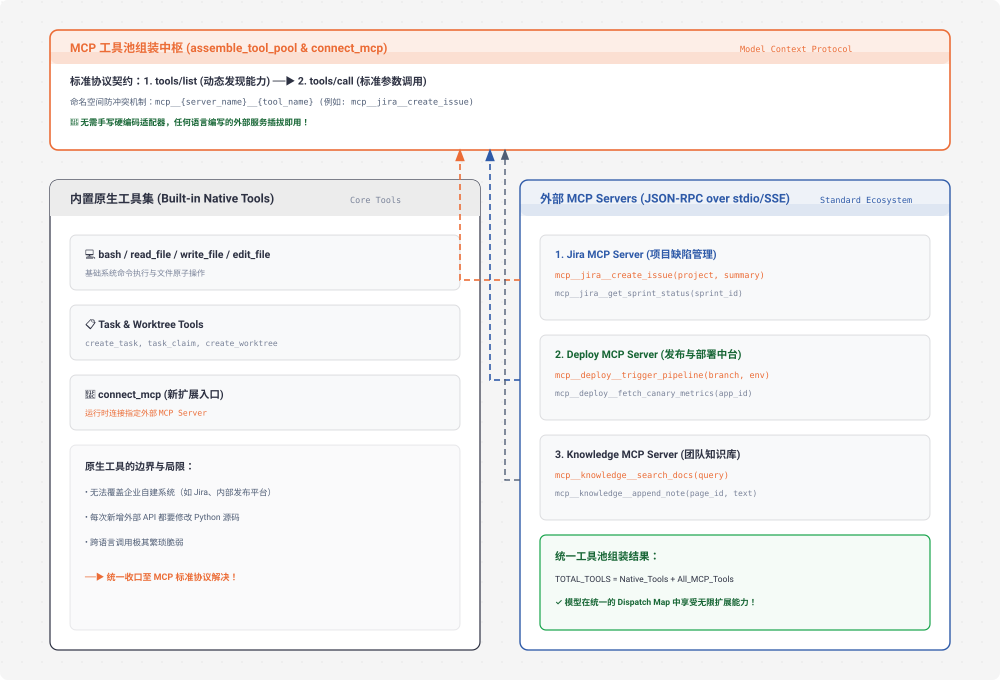

# s19 深度解析：MCP Plugin 外部工具接入与标准协议架构

> **核心格言**：*“外接工具，标准协议”* —— 发现、组装、调用，Agent 不需要知道工具是谁写的。  
> **架构定位**：Harness 层的**开放工具扩展生态与标准化协议连接器**，通过 Anthropic 推出的 Model Context Protocol (MCP) 实现外部能力的即插即用。

---

## 🌟 动态全景流转图 (Animated MCP Tools Topology)

<div align="center">
  
</div>

---

## 一、为什么必须有 s19？（设计动机）

在 `s01` 到 `s18` 中，Agent 手头所有的工具都是我们在 Python 中**硬编码手写**的（`bash`, `read_file`, `write_file`, `create_task` 等）。

### 硬编码工具的瓶颈：
* 你的团队有 3 个现成系统想接入 Agent：
  1. 内部 Jira 系统（查 Issue、改状态）；
  2. Kubernetes / CI-CD 发布系统（触发部署、拉取容器日志）；
  3. Notion / Confluence 文档知识库（查询公司内网 API 规范）。
* **传统做法**：你必须为每一个系统用 Python 写一套 API 封装、定义 Schema、处理认证和错误，维护成本极高，且无法跨语言复用。

**Harness 的标准协议解法**：接入 **MCP（Model Context Protocol）**。外部服务只要用任何语言（Node.js / Go / Rust / Python）实现标准的 JSON-RPC 接口，Agent 通过通用 `MCPClient` 即可在运行时**自动发现（`tools/list`）**并**自动组装（`tools/call`）**，彻底实现能力大爆炸！

---

## 二、端到端实战演练与终端执行全流程追踪 (Hands-on CLI Walkthrough)

### 1. 启动命令
打开终端并运行 S19 代码：
```bash
python s19_mcp_plugin/code.py
```

### 2. 模拟输入指令
在终端提示符输入连接 MCP Server 并调用外部工具的指令：
```text
s19 >> 连接外部的 jira 和 deploy 两个 MCP Server，查看动态发现了哪些新工具，并使用 jira 工具为登录模块报一个缺陷工单。
```

### 3. 终端实时执行日志全景追踪 (Log Trace)
```text
# ── 1. 动态连接外部 MCP Server 并执行 tools/list 发现 ──
> connect_mcp (server="jira")
  [mcp] Connected to 'jira' server (stdio transport)
  [mcp tools/list] 发现 2 个工具: create_issue, get_issue
  [mcp register] 注册带命名空间工具: mcp__jira__create_issue, mcp__jira__get_issue

> connect_mcp (server="deploy")
  [mcp] Connected to 'deploy' server (stdio transport)
  [mcp tools/list] 发现 2 个工具: trigger_pipeline, get_status
  [mcp register] 注册带命名空间工具: mcp__deploy__trigger_pipeline, mcp__deploy__get_status

# ── 2. 工具池动态总装 (assemble_tool_pool) ──
  [pool] 统一工具池更新完成: 包含 5 个原生工具 + 4 个 MCP 扩展工具

# ── 3. 模型决策调用 MCP 外部工具 ──
> mcp__jira__create_issue
  [mcp dispatch] 路由至 ACTIVE_MCP_CLIENTS["jira"]
  [mcp tools/call] 远程 RPC 响应: Issue AUTH-2048 created successfully!

已成功连接 Jira 与 Deploy 外部服务：
1. 动态接入了 4 个新工具；
2. 成功调用 `mcp__jira__create_issue` 创建了工单【AUTH-2048: 修复登录鉴权缺陷】。
```

---

## 三、MCP 协议核心交互三步走

1. **建立连接 (Handshake & Init)**：
   * Agent 通过 stdio（子进程管道）或 SSE（HTTP Server-Sent Events）连接指定的 MCP Server。
2. **能力动态发现 (`tools/list`)**：
   * Server 返回其拥有的全部工具列表与其 JSON Schema 定义；
   * Harness 自动将这些工具注册进大模型的 `TOOLS` 列表中。
3. **命名空间隔离 (Namespacing)**：
   * 为了防止两个不同的 Server 提供同名工具（例如都叫 `search`），Harness 采用双下划线统一规范命名：
     `mcp__{server_name}__{tool_name}`（如 `mcp__jira__create_issue`）。
4. **标准调用分发 (`tools/call`)**：
   * 大模型调用该工具时，Harness 查表识别出属于 MCP 工具，通过 JSON-RPC 将参数原样转发给对应 Server 执行，并将返回值喂回。

---

## 四、关键源码逐行深度拆解与 Python 语法糖详解

### 1. 命名空间重命名与浅拷贝
```python
class MCPClient:
    """标准 MCP 客户端封装"""
    def __init__(self, server_name: str):
        self.server_name = server_name
        self.tools: list[dict] = []
        self._handlers: dict[str, callable] = {}

    def discover_tools(self, tool_defs: list[dict], handlers: dict):
        """执行 tools/list，并为所有工具打上命名空间前缀"""
        for t in tool_defs:
            namespaced_name = f"mcp__{self.server_name}__{t['name']}"
            
            # 🔍 语法糖 1：dict.copy() 浅拷贝
            # 必须创建字典副本，避免修改原始定义对象导致潜在的污染
            t_copy = t.copy()
            t_copy["name"] = namespaced_name
            self.tools.append(t_copy)
            self._handlers[namespaced_name] = handlers[t["name"]]

    def call_tool(self, namespaced_name: str, args: dict) -> str:
        """执行 tools/call"""
        handler = self._handlers.get(namespaced_name)
        if not handler:
            return f"Error: Unknown MCP tool {namespaced_name}"
            
        # 🔍 语法糖 2：**args 字典解包
        # 将传入的字典参数解包成函数的关键字参数进行调用
        return handler(**args)
```

---

### 2. 经典闭包陷阱与默认参数捕获
```python
ACTIVE_MCP_CLIENTS: dict[str, MCPClient] = {}

def assemble_tool_pool() -> tuple[list[dict], dict]:
    """将内置原生工具与所有已连接的 MCP 工具组装成统一工具池"""
    pool_tools = list(NATIVE_TOOLS)
    pool_handlers = dict(NATIVE_HANDLERS)
    
    for client in ACTIVE_MCP_CLIENTS.values():
        pool_tools.extend(client.tools)
        for t in client.tools:
            name = t["name"]
            
            # 🔍 核心高阶语法糖：Lambda 循环闭包中的默认参数绑定
            # 
            # ❌ 错误写法（新手最常踩的大坑）：
            # pool_handlers[name] = lambda **kw: client.call_tool(name, kw)
            # 在这种写法下，lambda 内部引用的 client 和 name 是自由变量（动态晚绑定）。
            # 循环结束后，所有注册的工具 handler 都会指向循环最后一轮的那个 client 和 name！
            #
            # ✅ 正确写法：
            # pool_handlers[name] = lambda c=client, n=name, **kw: c.call_tool(n, kw)
            # 利用 Python“默认参数在函数定义时立即求值”的特性，
            # 将当前轮次的 client 和 name 固化保存在当前 lambda 的局部参数默认值中，
            # 彻底杜绝变量覆盖问题！
            pool_handlers[name] = (
                lambda c=client, n=name, **kw: c.call_tool(n, kw)
            )
            
    return pool_tools, pool_handlers
```

---

## 五、Claude Code (CC) 源码深度映射

在真实的 Claude Code 生产源码中（`mcp/` 体系）：
* **多传输层支持 (Multi-Transport)**：支持基于本地 Stdio 子进程启动（`npx -y @modelcontextprotocol/server-postgres`）以及远程远程 HTTP + SSE 代理。
* **OAuth 授权与动态刷新**：对于企业级 MCP Server（如 GitHub / Sentry），内置 OAuth 鉴权流，Token 过期时无缝静默刷新。

---

## 🎯 总结与启示

* **MCP 是 AI 时代的 USB 接口**。
* 有了 MCP，Agent 的四肢伸向了全网所有的软件系统与 API，真正做到了“天下能力，皆为我用”！
