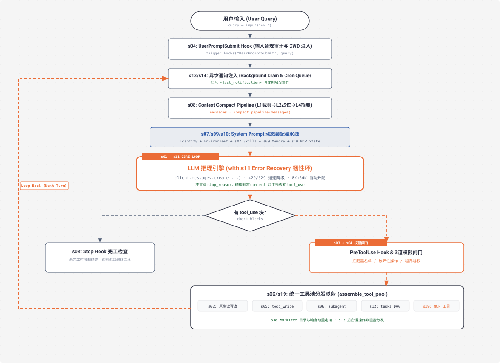

# s20 深度解析：Comprehensive Agent 全部机制大一统循环架构

> **核心格言**：*“机制很多，循环一个”* —— 工具、权限、记忆、任务、团队、插件全部收敛归位到同一个 `while True` 主循环。  
> **架构定位**：Harness 层的**终极大成之作**，将前 19 章所有分散的机制无缝装配成一个生产级全功能的统一 Agent Harness。

---

## 🌟 动态全景流转图 (Animated Comprehensive Agent Pipeline)

<div align="center">
  
</div>

---

## 一、为什么必须有 s20？（终章立意）

前 19 章每章只引入一个孤立的机制（为了降低学习坡度）。但真实的生产级 Coding Agent（如 Claude Code / Cursor / Devin）绝对不会每次只带一个机制运行。

### 生产级 Agent 的真实复杂度：
一个能够接管复杂工程研发的 Agent，必须在**同一个运行时会话中同时具备**：
1. **工具与安全**：`s02` 原生工具 + `s03` 权限闸门 + `s04` 生命周期 Hooks；
2. **规划与隔离**：`s05` TODO 锚点 + `s06` Subagent 隔离 + `s18` Worktree 目录沙箱；
3. **知识与记忆**：`s07` 技能按需加载 + `s09` 长期记忆沉淀 + `s10` System Prompt 动态装配；
4. **长效与韧性**：`s08` 四层上下文压缩 + `s11` 错误自愈韧性环 + `s12` 任务 DAG 图；
5. **并发与扩展**：`s13` 后台异步执行 + `s14` Cron 定时调度 + `s15~s17` 团队自治 + `s19` MCP 开放生态。

**难点不在于堆砌代码，而在于看清楚这些机制全部挂在循环的哪一个精确位置！**

---

## 二、端到端实战演练与终端执行全流程追踪 (Hands-on CLI Walkthrough)

### 1. 启动命令
打开终端并运行 S20 终极综合 Agent 代码：
```bash
python s20_comprehensive/code.py
```

### 2. 模拟输入指令
输入一个融合了定时任务、Worktree 沙箱、记忆提取与工具调用的复合指令：
```text
s20 >> 1. 设定每 30 分钟检查一次 Git 状态的定时任务；2. 在名为 'feature-jwt' 的新 worktree 中创建 auth.py 并实现生成 Token 的逻辑；3. 把“我们统一使用 HS256 加密”写入长期记忆。
```

### 3. 终端实时执行日志全景追踪（10 大阶段依次点亮）
```text
# ── 阶段 1: UserPromptSubmit Hook 触发 ──
  [HOOK] UserPromptSubmit: working in /Users/.../study
  [audit] 用户输入合规性检测通过

# ── 阶段 2: 异步事件与 Cron 排空 ──
  [drain] background notifications: 0, cron queue: 0

# ── 阶段 3: 上下文四层压缩净化 ──
  [compact] 当前 Token 占用 12,450 / 80,000 (水位正常，放行)

# ── 阶段 4: 运行时动态 Prompt 装配 ──
  [prompt] 装配 Identity + Git:main + 8个原生工具 + 2个MCP工具 + 技能清单

# ── 阶段 5: 模型推理 (with s11 韧性环) ──
  [LLM] 发起请求，max_tokens=8000 ...

# ── 阶段 6: 工具解析与 PreToolUse 权限闸门拦截 ──
> schedule_cron
  [HOOK] PreToolUse: schedule_cron(cron="*/30 * * * *", prompt="...")
  [Gate 1/2] 校验通过 -> 放行执行
  [cron register] cron_004821 '*/30 * * * *' 注册成功

> create_worktree
  [HOOK] PreToolUse: create_worktree(name="feature-jwt")
  [git] git worktree add .worktrees/feature-jwt -b wt/feature-jwt HEAD
  Worktree 'feature-jwt' created

> write_file (在 worktree 沙箱内执行)
  [HOOK] PreToolUse: write_file("auth.py")
  [cwd redirect] -> .worktrees/feature-jwt/auth.py
  Wrote 320 bytes to auth.py

> write_memory
  [HOOK] PreToolUse: write_memory(name="jwt-algorithm", body="统一使用 HS256 加密")
  [memory] 写入 .memory/jwt-algorithm.md 并重新生成 MEMORY.md 索引

# ── 阶段 7: PostToolUse 后置审计 ──
  [HOOK] PostToolUse: 审计输出尺寸正常

# ── 阶段 8: 结果回灌并完成收尾 ──
所有复合任务已全部成功完成：
1. ⏰ 定时调度已激活：每 30 分钟自动巡检 Git；
2. 🌳 Worktree 物理隔离：代码已安全写入 `.worktrees/feature-jwt/auth.py`；
3. 🧠 长期记忆已沉淀：HS256 规范已落盘，未来会话永久生效！
```

### 4. 打开第二个终端验证多系统联动成果 (Full Inspection)
```bash
# 1. 验证 Cron 定时任务是否落盘
cat .scheduled_tasks.json

# 2. 验证 Worktree 分支与文件
git worktree list
cat .worktrees/feature-jwt/auth.py

# 3. 验证长期记忆索引与内容
cat .memory/MEMORY.md
cat .memory/jwt-algorithm.md
```

---

## 三、大一统循环中的组件归位拓扑 (The Grand Loop)

一个完整的 Agent Turn，数据流依次穿越以下关卡：

```
 1. [用户输入] ──► 触发 UserPromptSubmit Hook (输入合规审计 & CWD 注入)
                         │
 2. [异步注入] ──► 排空 Background 队列与 Cron Queue (注入 <task_notification>)
                         │
 3. [上下文净化] ─► 穿越 Context Compact 四层管线 (L1 裁剪 ──► L2 占位 ──► L4 Haiku 摘要)
                         │
 4. [提示词装配] ─► System Prompt 动态装配 (Identity + CWD + Skills + Memory + MCP)
                         │
 5. [模型推理] ──► LLM Inference (包裹在 s11 Error Recovery 自愈环中，带 8K→64K 升配)
                         │
 6. [行为判定] ──► 检查响应 content 中是否存在具体 tool_use block
                         ├── [无工具调用] ──► 触发 Stop Hook (完工检查，可强制续跑) ──► 退出返回
                         └── [有工具调用] ──► 进入工具管线
                                                    │
 7. [权限拦截] ─────────────────────────────► 触发 PreToolUse Hook (3道权限闸门拦截)
                                                    │ (放行)
 8. [统一分发] ─────────────────────────────► assemble_tool_pool (Native + Task + MCP)
                                                    │ (重定向至 s18 Worktree 独立目录)
 9. [后置审计] ─────────────────────────────► 触发 PostToolUse Hook (大输出监控)
                                                    │
10. [闭环回灌] ─────────────────────────────► 组装 tool_result 回 messages[] ──► 开启下一轮！
```

---

## 四、关键源码逐行深度拆解与 Python 语法糖详解

### 1. 高阶函数 `filter(None, ...)` 优雅拼接 Prompt
```python
def assemble_system_prompt(sections: list[str | None]) -> str:
    """
    🔍 语法糖 1：高阶过滤器 `filter(None, iterable)`
    在 Python 中，当 filter 的第一个参数传入 None 时，它会自动充当布尔真值判定器（bool()），
    自动从列表中过滤掉所有的假值（False、None、空字符串 ""、空列表 [] 等）。
    最后使用 "\n\n".join(...) 进行段落拼接，确保各 Section 之间格式整齐干净！
    """
    return "\n\n".join(filter(None, sections))
```

---

### 2. 安全属性提取 `getattr()` 与大一统主循环
```python
def comprehensive_agent_loop(messages: list):
    """大一统全功能 Agent 核心主循环"""
    state = ComprehensiveState()

    while True:
        # ① 异步事件注入 (s13 Background + s14 Cron)
        drain_background_notifications(messages)
        drain_cron_queue(messages)

        # ② 上下文四层压缩净化 (s08)
        messages = compact_pipeline(messages)

        # ③ 动态装配 System Prompt (s07 Skills + s09 Memory + s10 Sections + s19 MCP)
        tools_def, tool_handlers = assemble_tool_pool()
        system_prompt = prompt_builder.assemble(
            enabled_tools=list(tool_handlers.keys()),
            mcp_state=get_mcp_summary()
        )

        # ④ 带自愈恢复的模型请求 (s01 Loop + s11 Error Recovery)
        response = call_llm_with_error_recovery(
            messages=messages,
            system=system_prompt,
            tools=tools_def,
            state=state
        )
        messages.append({"role": "assistant", "content": response.content})

        # 🔍 语法糖 2：安全属性获取 `getattr(b, "type", None)`
        # 为什么不写 `b.type == "tool_use"`？
        # 因为在不同的 SDK 版本或自定义 Mock 测试中，返回的可能是普通 dict 也可能是对象实例。
        # 直接访问 `b.type` 可能抛出 AttributeError 导致整个服务崩溃；
        # getattr(b, "type", None) 会在属性不存在时安全返回默认值 None，工业级健壮！
        tool_calls = [
            b for b in response.content 
            if getattr(b, "type", None) == "tool_use" or (isinstance(b, dict) and b.get("type") == "tool_use")
        ]
        
        # 无工具调用：退出分支
        if not tool_calls:
            force_msg = trigger_hooks("Stop", messages)
            if force_msg:  # 强制续跑
                messages.append({"role": "user", "content": force_msg})
                continue
            return  # 正常收尾退出

        # ⑤ 遍历执行工具调用
        results = []
        for block in tool_calls:
            # 前置安全与权限拦截 (s03 + s04)
            blocked_reason = trigger_hooks("PreToolUse", block)
            if blocked_reason:
                results.append({"type": "tool_result", "tool_use_id": block.id, "content": str(blocked_reason)})
                continue

            # 统一工具池分发 (Native + s05 Todo + s06 Subagent + s12 Task + s19 MCP)
            handler = tool_handlers.get(block.name)
            if handler:
                # 配合 s18 Worktree 自动重定向工作目录
                output = execute_with_worktree_context(handler, block.input, state.wt_ctx)
            else:
                output = f"Unknown tool: {block.name}"

            # 后置审计钩子 (s04)
            trigger_hooks("PostToolUse", block, output)
            results.append({"type": "tool_result", "tool_use_id": block.id, "content": output})

        # ⑥ 结果回灌，无缝开启下一轮
        messages.append({"role": "user", "content": results})
```

---

## 五、Claude Code (CC) 源码的终极映射

在完整的 Claude Code 架构（`query.ts` 1729 行）中：
* **核心结构一模一样**：就是上面这 50 行包含状态机调谐的 `while True`。
* **智能来自 Claude（模型），载具属于 Harness（工程）**：Harness 没有让 Claude 变聪明，但 Harness 给 Claude 装上了双眼（Read/Grep/Glob）、双臂（Bash/Edit/MCP）、记忆（Memory/Compact）、秩序（Tasks/Worktrees/Protocols）和护栏（Permissions/Hooks）。

---

## 🎯 课程总结与毕业礼

* 从 **`s01` 的 30 行最小死循环**，到 **`s20` 汇聚 19 大子系统的完备 Agent 操作系统**：
* 你不仅掌握了 Claude Code 的底层原理；
* 更掌握了一套能够**跨越软件工程、金融量化、智能硬件、自动化运维等任何复杂领域的通用 Agent Harness 架构设计心智**！

**“Agency 来自模型，Harness 让 Agency 落地。造好 Harness，模型会完成剩下的！”**
